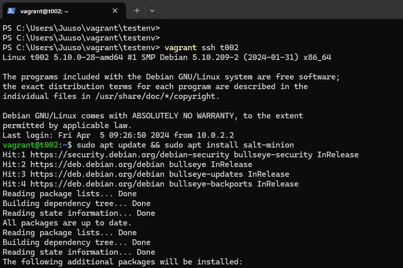
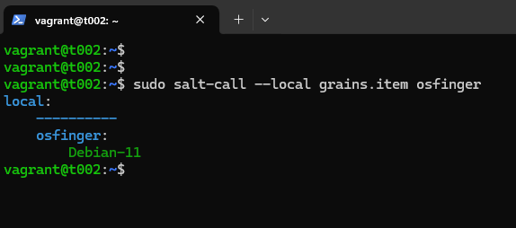
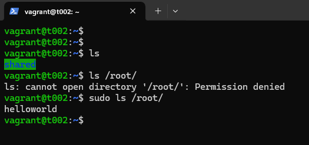
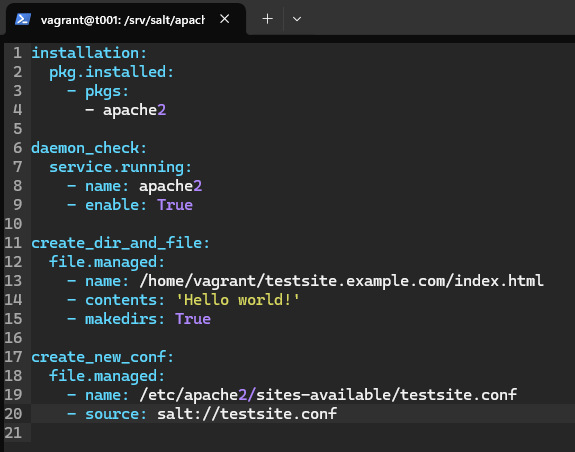

# Introduction

This is the report for homework assignment number two. The assignment is divided into subtasks.

- Task x. Read and summarize. A couple of bullet points per post. The posts are the following, "Two Machine Virtual Network With Debian 11 Bullseye and Vagrant" by Tero Karvinen (2021), "Salt Quickstart – Salt Stack Master and Slave on Ubuntu Linux" by Tero Karvinen (2018) and "Hello Salt Infra-as-Code" by Tero Karvinen (2014).
- Task a. Configure two virtual machines to reside inside the same network. It is recommended to do this with Vagrant.
- Task b. Set up Salt's master-slave architecture to work over the network. The network can be a virtual network between the local virtual machines.
- Task c. Run shell commands with the minion over the master connection.
- Task d. Idempotence. Run multiple state.single commands over the master-slave connection.
- Task e. Gather technical information from the minions.
- Task f. Write some IaC (Infrastructure as Code) to /srv/salt/hello/init.sls. Make a minion apply it.

(Karvinen 2024)

# Written tasks

## Task x. "Two Machine Virtual Network With Debian 11 Bullseye and Vagrant" summarized

- To start, Vagrant and VirtualBox should be installed.
- Create a new directory and a file called Vagrantfile. Inside the file copy the script found in the post.
- `vagrant ssh t001` to connect and `exit` to exit the connection.
- Check the connection with `ping -c 1 [the other machine's IP]` and `ping -c 1 8.8.8.8`.
- Destroy the machines with `vagrant destroy`.
- Get a fresh set of machines with `vagrant up`.

(Karvinen 2021)

## Task x. "Salt Quickstart – Salt Stack Master and Slave on Ubuntu Linux" summarized

- Install master with `sudo apt-get -y install salt-master` after `sudo apt-get update`.
- Check the IP address with `hostname -I`. Remember to open ports 4505/tcp and 4506/tcp.
- Install the minion on another machine with `sudo apt-get -y install salt-minion` after `sudo apt-get update`.
- Open the minion configuration with `sudoedit /etc/salt/minion` and add the first line. The second line is optional.

      master: [Master's IP]
      id: [Minion's name]

- Restart the daemon with `sudo systemctl restart salt-minion.service`
- Go back to the master and accept the key with `sudo salt-key -A`.
- Try some commands. `sudo salt '*' cmd.run 'whoami'` is a good start.

(Karvinen 2018)

## Task x. "Hello Salt Infra-as-Code" summarized

- Install salt `sudo apt-get update` & `sudo apt-get -y install salt-minion`.
- Create a directory for a module with `sudo mkdir -p /srv/salt/hello/` & `cd /srv/salt/hello/`
- Create a file with `sudoedit init.sls`. init.sls is the module's entrypoint.
- A code example

      /tmp/hellotero:
        file.managed

- Run it with `sudo salt-call --local state.apply hello`.
- Check that the file was created with `ls /tmp/hellotero`.
- Run the states again to gain idempotence.

(Karvinen 2024)

# Practical tasks

## Essential information

Machine information.

In addition to this information, I had 260 GB of free space on my SSD. I was at home in Vaasa, and I used a good wireless connection.

## Task a. Two VMs in the same network with Vagrant

I started this task on April 5, 2024 at 12:12 PM.

First, I opened Windows PowerShell that I already had in my taskbar. Then I changed into the vagrant directory. There I wanted to check out the vagrantfile that I already had.

Then I created a new directory called testenv.

There I created a new file with `code Vagrantfile`. This opens VsCode and creates a file called "Vagrantfile". Inside the file I copied the configuration found in the post "Two Machine Virtual Network With Debian 11 Bullseye and Vagrant" by Karvinen (2021).

This is my interpretation of the code. I haven't used Ruby before, but the big picture of the code seems easy enough to understand.

- Lines 5 to 10 is a script that runs when provisioning.

- Line 12 starts a Vagrant configure and the config ends on line 28

- Lines 13 to 16 configures the following. Synced folder "." & "/vagrant" are disabled. Creates "shared/" & "/home/vagrant/shared" as synced folders. Attaches the inline script found on lines 5 through 10 to provision. Configures the boxes to be bullseye64 version of Debian.

- Lines 18 to 21 configures the first box. It names the box t001 and assigns it to network "private_network" and assigns it an IP address of 192.168.88.101.

- Lines 23 to 26 uses the same logic to configure box two.

- Line 28 ends the config started at line 12.

After I created the file, I checked that the file was indeed where I wanted it to be.

Then I started the machines with vagrant up.

Here I wanted to show the script running.

Once they were up, I checked that they appeared inside the VirtualBox manager app.

Then I connected to the first box and tested that I could ping the other box and Google's DNS.

Then I tested that I could ping machine one with machine two.

After the tests, I Installed ufw and enabled it on both machines. `sudo ufw allow 22/tcp` is a crucial step.

I was done with this at 12:27 PM

Since I had other things to tend to, I decided to shut down the machines and continue later on.

## Task b. Master-Slave architecture

I started this task at 4:08 PM.

I opened Windows PowerShell by clicking on it in the taskbar. Then I changed directories and started the machines.

Once they were up, I connected to the soon to be master machine and updated the repos.

Then I installed salt-master.

Since I had a firewall enabled, I created two holes (Karvinen 2018).

Here I checked the IP address of the master.

Then I exited with exit and connected to the soon to be minion. There I updated and installed the salt-minion.

I checked that the minion was up and working.

Then I needed to tell the minion the master's address. I opened the configuration file with `sudoedit /etc/salt/minion`. There I made some space at the top and added the master's address and gave the minion a fitting name. (Karvinen 2018)

To apply the changes, the daemon needed to be kicked which means restarting.

Then I connected to the master and accepted the key (Karvinen 2018).

A couple of tests (Karvinen 2018).

I was done at 4:22 PM.

## Task c. Shell commands.

I started this at 4:36 PM.

In addition to the commands I used in the last task, I created a file with cmd.run over the connection and checked that the file appeared. The wildcard `*` means all minions so I experimented using the name of the minion instead.

After this, I wanted to doublecheck that the file appeared. I exited with `exit` and connected with `vagrant ssh t002`. There I checked the home directory, but the file wasn't there, and I realized that it uses root, so I checked the root's home directory and the file was there.

I was done at 4:39 PM.

## Task d. Idempotence

I started this task at 4:48 PM.

Since I knew that the package 'tree' was installed when I provisioned the machines, I demonstrated idempotence with pkg.installed tree. Nothing was changed because the tree was already installed. I installed Apache.

Apache wasn't already installed so the command installed it.

Then I used the same command to demonstrate idempotence.

I wanted to manually check that Apache was installed.

Then I changed back to the master and demonstrated another way of checking.

Here I wanted the minion to have a state where Apache was removed.

And to check that the service was no more...

A better way of checking would be to use the command `sudo salt '*' state.single pkg.removed apache2` again. This way would ensure idempotence. Here I wanted to demo a failed summary.

Then I checked that the user root is present.

Here I made a file with some text in it.

And to demo idempotence.

Then I checked the contents.

I was done at 4:59 PM.

## Task e. Technical information

I started this task at 5:15 PM.

First I listed all the items to choose a couple of interesting ones.

Here are the three I chose to show in more detail. I thougth that these would fit the theme well.

- id -> The name of the minion
- ipv4 -> NAT interface IPv4, Loopback IPv4 and the manually assigned IPv4
- master -> The master's IPv4 address.

I was done at 5:20 PM.

## Task f. Hello IaC.

I started this task at 5:39 PM.

I installed micro with `sudo apt install micro` and then I used `export EDITOR=micro` to make it so micro opens when using sudoedit (Karvinen 2024).

First I made a new directory and created an init.sls file (Karvinen 2024).

These are the first two states that I created (Saltproject s.a).

My vision was to make an IaC file that configures Apache and makes it change the default page. I started small with install and service check.

Then I tested it and ran into an error. It was an easy fix. The line 3 was written wrong.

Here I fixed it and then I used cat to show how it should be written (Saltproject s.a). Then I tested it again and ran into a second error. Well at least the other error was gone. Now this error was because I forgot to and the service name to the service.running state.

I fixed it and tested it again successfully.

Then I created a file that I will be using as a source for the next state.

These are the contents I wrote. (GitJuski 2024)

So I added a new state that creates a directory and a file (Saltproject s.a).

Tested that it works.

And checked the results.

Then I added a new state to the init.sls file (Saltproject s.a). This is the part where I used the source.

That didn't work.

I tried with `testsite.conf`, `/srv/salt/apache_server/testsite.conf`. Then I removed the suffix and tried again without success. Then I tried this which worked.

Then I checked the results.

Then I added curl as one of the packages alongside Apache.

Here I added three new states. The first one enables the new conf, the second one disables the old conf and the third one curls localhost. `cwd` = current working directory. `onlyif` applies this state if the old conf is enabled. (ChatGPT)

I tested this and forgot that I don't restart Apache anywhere in this. For anyone interested in the output, here it is.

[first.txt](miscellaneous/first.txt)

Then I added a new state before the curl. Lines 38 and 39 makes it so the state is applied if the disable_old_conf state is applied. (ChatGPT)

Here I went ahead to revert some changes manually since I thougth it that it was the faster route. I disabled the new conf and enabled the default one to test my init.sls better.

It worked!

Here is the output for anyone interested.

[second.txt](miscellaneous/second.txt)

Here I tried it again to check how idempotent it is. The cmd.run states makes it to not be idempotent.

I wanted to make it idempotent, so I replaced curl with this (Saltproject s.a) and removed curl from the installation state. I also added the onlyif line to the enable_new_conf so it only runs if the default conf is enabled.

Something went wrong.

To fix it I added http:// like it was portrayed in saltprojects post (s.a).

Then I tested it and it worked. Nothing was changed and I had idempotence.

Here's the output for anyone interested enough.

[third.txt](miscellaneous/third.txt)

I went ahead to test it.

Then I deleted Apache, removed some directories and files. I did it to test my IaC from a clean sleet.

I tested my IaC for the last time. Two states didn't change since the service.running was true after installation and the http.query was true after other steps. With this in mind my IaC did its thing and demonstrated idempotence.

Here's the last output.

[fourth.txt](miscellaneous/fourth.txt)

I was done at 6:56 PM.

I decided to show that it was idempotent. I connected back and changed directories to with `cd /srv/salt/apache_server/` and used `sudo salt Kätyri state.apply apache_server`

And here's the final output.

[fifth.txt](miscellaneous/fifth.txt)

I could've gone down deeper into the rabbit hole, but I decided to stop myself here. This is the IaC.

# References

ChatGPT questions asked on April 5, 2024. [ChatGPT_reference.txt](miscellaneous/ChatGPT_reference.txt).

GitJuski 2024. h3-GJ. Available at https://github.com/GitJuski/Linux-servers/blob/main/h3-GJ.md. Read on April 5, 2024.

Karvinen, T 2024. Infra as Code - Palvelinten hallinta 2024. Available at https://terokarvinen.com/2024/configuration-management-2024-spring/.

Karvinen, T 2021. Two Machine Virtual Network With Debian 11 Bullseye and Vagrant. Available at https://terokarvinen.com/2021/two-machine-virtual-network-with-debian-11-bullseye-and-vagrant/. Read on April 5, 2024.

Karvinen, T 2018. Salt Quickstart – Salt Stack Master and Slave on Ubuntu Linux. Available at https://terokarvinen.com/2018/salt-quickstart-salt-stack-master-and-slave-on-ubuntu-linux/?fromSearch=salt%20quickstart%20salt%20stack%20master%20and%20slave%20on%20ubuntu%20linux. Read on April 5, 2024.

Karvinen, T 2024. Hello Salt Infra-as-Code. Available at https://terokarvinen.com/2024/hello-salt-infra-as-code/. Read on April 5, 2024.

Saltproject s.a. salt.states.pkg. Available at https://docs.saltproject.io/en/latest/ref/states/all/salt.states.pkg.html. Read on April 5, 2024.

Saltproject s.a. salt.states.service. Available at https://docs.saltproject.io/en/latest/ref/states/all/salt.states.service.html. Read on April 5, 2024.

Saltproject s.a. salt.states.file. Available at https://docs.saltproject.io/en/latest/ref/states/all/salt.states.file.html. Read on April 5, 2024.

Saltproject s.a. salt.states.http. Available at https://docs.saltproject.io/en/latest/ref/states/all/salt.states.http.html. Read on April 5, 2024.