# Indroduction

This is the report for homework assignment number three. The assignment is divided into subtasks which are the following:

- Task x. Read and summarize. I'm to summarize a post and some logs. Only a couple of bullets points are needed per post or log. The posts are the following:
    - Chacon and Straub 2014: Pro Git, 2ed: 1.3 Getting Started - What is Git?
    - Git usage 'git add . && git commit; git pull && git push'. Explain the individual parts of the command. Use appropriate references.
    - The log of the repo terokarvinen/suolax

- Task a. Online. Create a new repository to Github. The name needs to contain the word 'summer'.

- Task b. Dolly. Clone the new repository, make chnages locally and push the changes.

- Task c. Doh! Make a stupid change (don't do a commit). Destroy the changes with 'git reset --hard'.

- Task d. Log. Check and analyze the logs of the repository. Verify that your name and email is showing like you want it to.

- Task e. Salted rack. Run salt-states from your own repository.

- Task f. Optional: The other system. Try Git with another operating system.

- Task g. Optional: Collaboration. Give commit access to your friend or your alter ego.

(Karvinen 2024)

## Task x. Getting started - What is Git? Post summarized.

COMING SOON...

## Task x. Git usage. Commands explained.

COMING SOON...

## Task x. Logs summarized.

COMING SOON... 

# The practical tasks

## Essential information

In addition to this information, I had all updates installed, had 257 GB of free space on my SSD, I wrote the report at home in Vaasa and I used a wireless connection that was good.

## Task a. Online

I started this task on April 11, 2024 at 11:24 AM.

First, I opened my browser in this case FireFox. I typed github.com and logged in. 

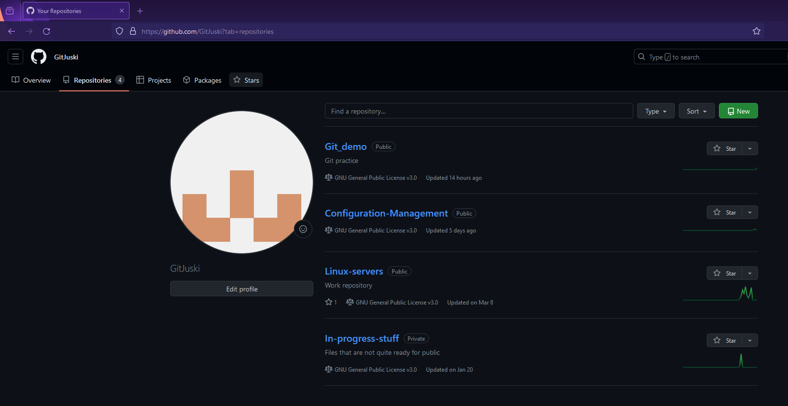

I opened the profile and repositories where I got the full view of my repositories. I clicked on new.

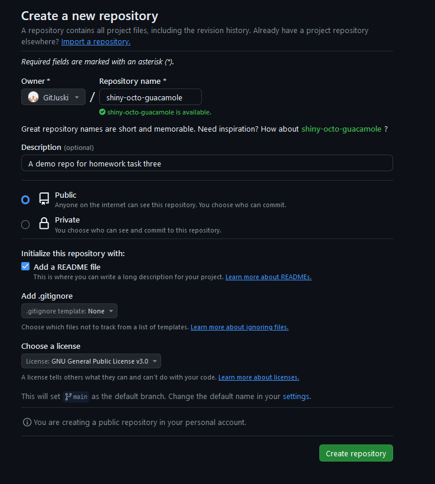

I gave the repository a new. Github recommended an interesting name so I used it since this is repo is for demonstrating purposes only. I made sure that the repo was public. Then I clicked on 'Add a README file' and chose the GNU GPL v3 as the license. Then I clicked on create repository.

The result looked like this.

Here I remembered that the name had to contain the strin 'summer' in it so I needed to rename it.

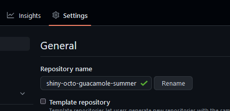

Here I opened the settings, added the summer string and clicked on rename.

I was done at 11:28 AM.

## Task b. Dolly.

I started this at 11:38 AM.

I opened Windows PowerShell by clicking the icon on my taskbar. I changed directory to a directory where I have some git repos.

I opened the Github in my browser to grab the ssh command. On my repos front page I clicked code and selected ssh tab. I copied the command.

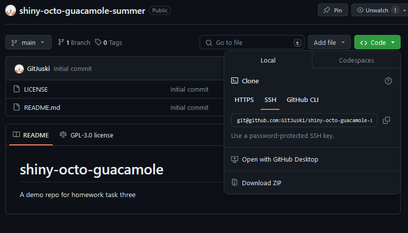

Inside the correct directory, I used git clone.

Then I used `cd .\shiny-octo-guacamole-summer\`. I opened the README with notepad since the changes were small.

I saved the changes and closed notepad. Then I used `git add .` and to check the changes I used `git diff --cached`.

Then I committed the changes. I added the -m to add the commit message right there. This was the first time trying to use two git commands on the same line. I've always used the separately one at a time. Ran into an error.

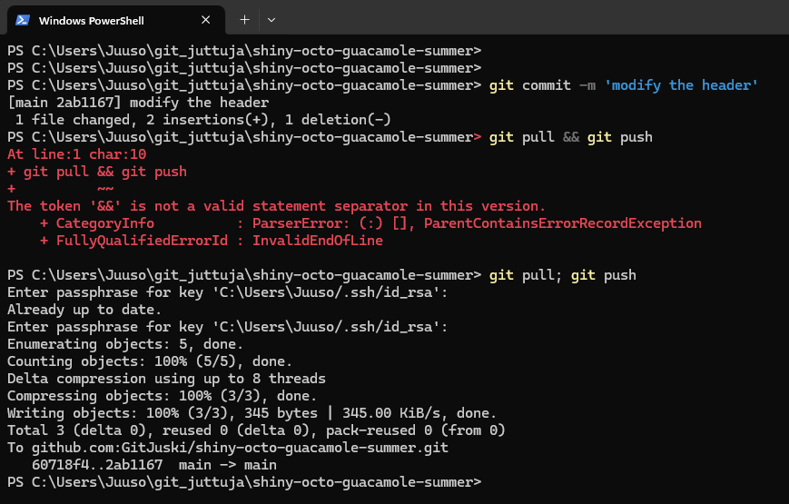

Seems like '&&' isn't a valid separator in PowerShell. So I decided to use a different separator `;`. That worked. I needed to input my private keys passphrase since I added it to increase security. This is one of those 'making something more secure, decreases the usability'.

Then I checked that the changes where really pushed.

Here's the commit

And here's the commit via CLI.

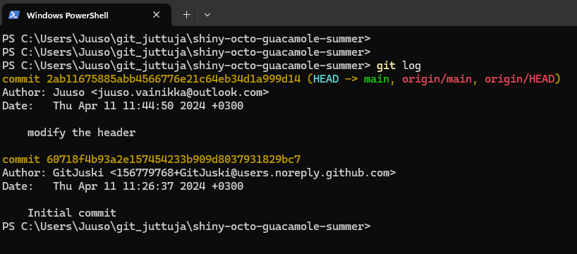

Here's the username and email I've changed yesterday.

I was done at 11:49 AM.

## Task c. Doh!

I started this at 12:10 PM.

First I made a new directory called doh.

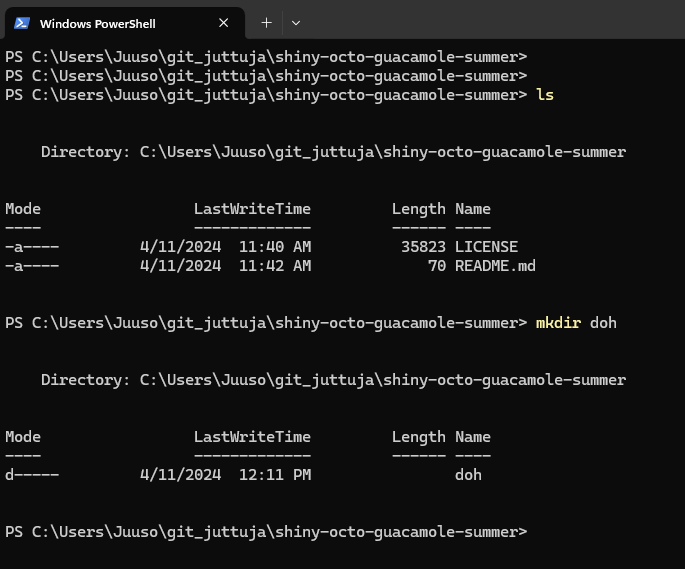

I went there with `cd` and made a file called oopsiefile.

Then I decided that I wanted to add some text in it.

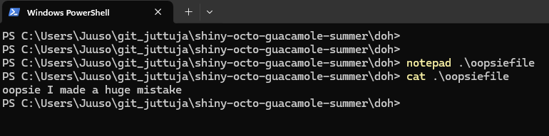

I added the changes and checked the status.

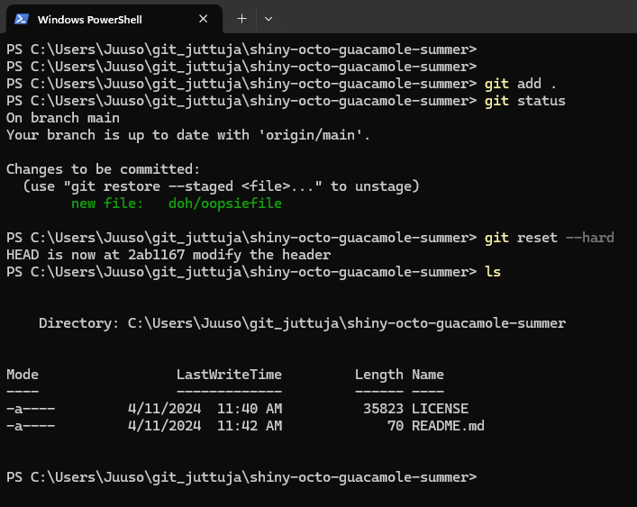

FInally I resetted the changes and checked that the directory was gone.

I was done at 12:19 PM.

## Task d. Logs.

I was back at 12:43 PM.

I made some changes to the README file. Then I added the changed and committed.

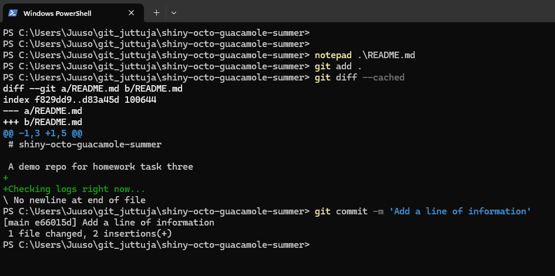

Before I pushed the changes, I checked the commit log.

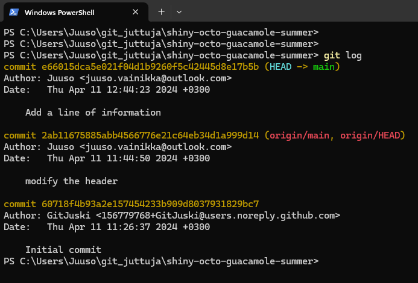

Here we can see the new commit. It shows the commit ID and the (HEAD -> main) shows us that the changes are local. The earlier commit has (origin/main, origin/HEAD). The origin is the remote repo we cloned from and push to. The author is the one doing the commits. with `git config --global user.name` and git `config --global user.name` these can be changed. The Date line shows us the date, time, year and timezone. Below that is the commit message. When I made the repo I created it using the web interface. That's why there is an initial commit by GitJuski.

Then I used `git pull` and `git push`. Here's the log entries after those actions.

The commit is the last was the last commit locally and remotely, hence (HEAD -> main, origin/main, origin/HEAD).

I was done at 12:46 PM.

## Task e. A salted rack

Back from lunch at 2:25 PM.

I wanted to do some tests before doing the real thing. I started by creating a new directory inside my vagrant dir.

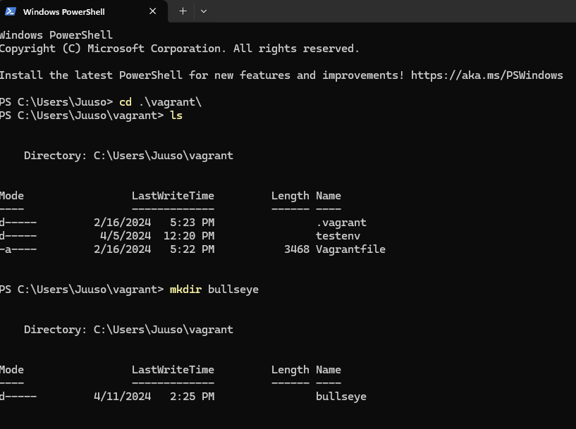

I created a vagrantfile with vagrant init.

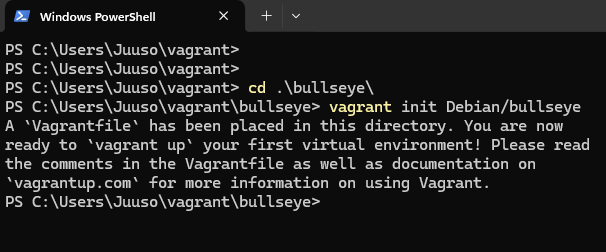

I opened the file with notepad and added the number 64 just to make sure, since I didn't do it when using vagrant init.

I connected via ssh.

I did the usual.

    sudo apt update && sudo apt upgrade
    sudo apt install ufw
    sudo ufw allow 22/tcp
    sudo ufw enable
    sudo apt install salt-minion
    sudo salt-call --local grains.item osfinger
       

Then I created a new directory and a module.

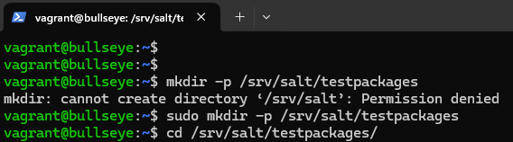

Inside I created a new init.sls file with `sudoedit init.sls`.

I once again forgot the `-` before pkgs.

I fixed it.

I moved the whole directory to the home directory `sudo mv /srv/ /home/vagrant/`. Then I tried to apply the state without success.

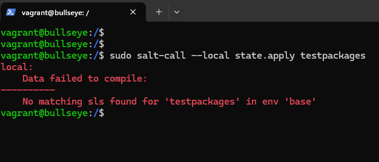

Then I tested with the --file-root. I first tried it with the current dir without success. Then with srv/salt relative path. (Karvinen 2024)

Then I created a MakeFile with `micro MakeFile`.

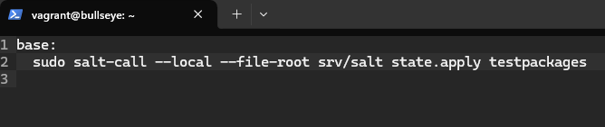

Make didn't work so I checked if it's even installed with `which make`. I installed it.

Some new errors. I renamed the file which got me forward.

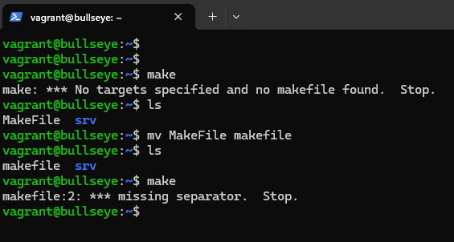

The problem was that I used two spaces instead of tab when indenting so I fixed it.

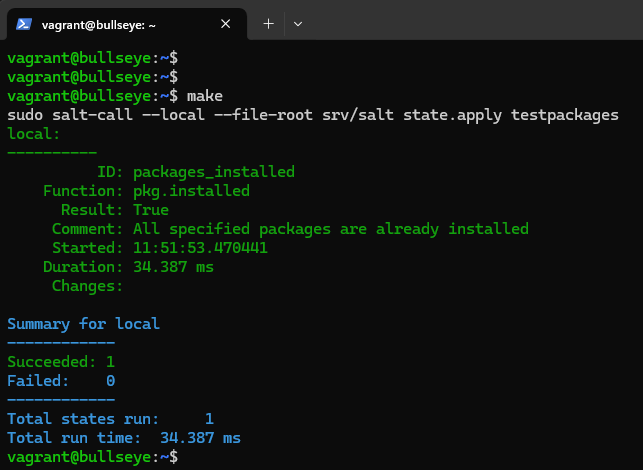

I tried to use make from a different dir without success and then I tried it with the -f flag without success.

At this point I realized that this isn't even part of the assignment so I stopped playing with make here.

I removed the makefile and the srv/ dir.

I opened a new tab in PowerShell and created a new dir inside the repo.

I created an init.sls file.

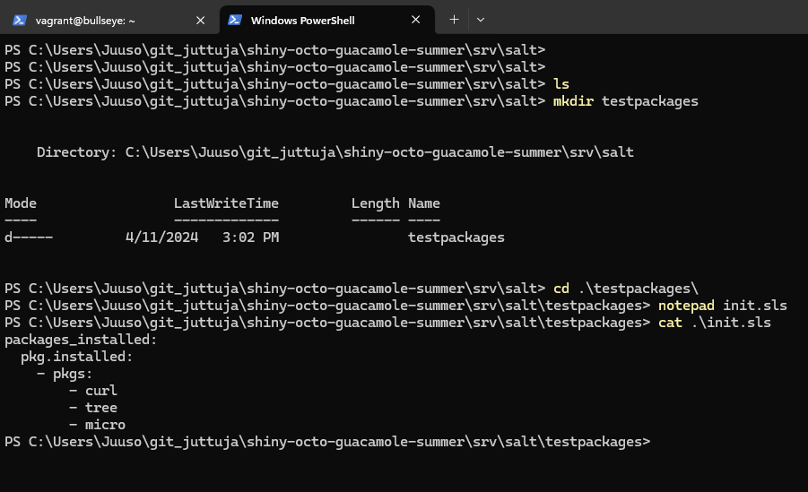

I committed and then used `git pull` and `git push`.

I checked that it got pushed.

Then I grabbed the https command.

Back to vagrant. I installed git with `sudo apt install git`. Then I created a new dir and cloned the repo there.

I moved to the new dir and tried the command.

It worked so I removed the packages to test again.

It works as intended.

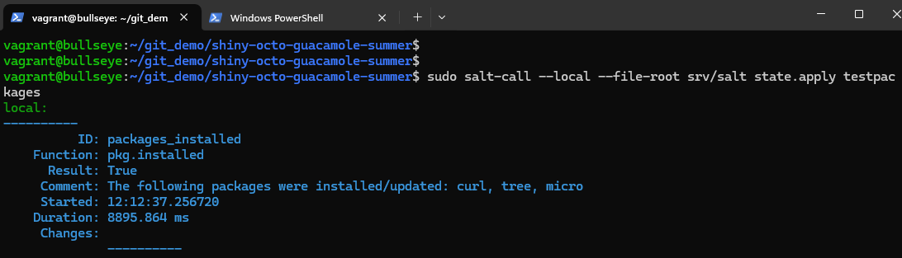

Tested from another directory.

I was done at 3:14 PM.

## Task f. The other system.

COMING SOON...

## Task g. Collaboration.

COMING SOON...

# References

Karvinen, T. 2024. Infra as Code - Palvelinten hallinta 2024. Available at https://terokarvinen.com/2024/configuration-management-2024-spring/.