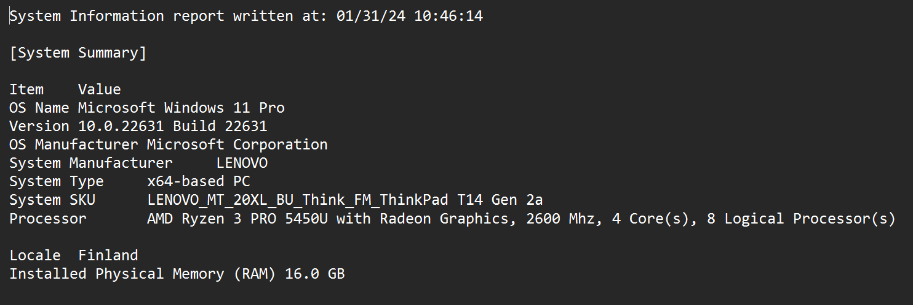
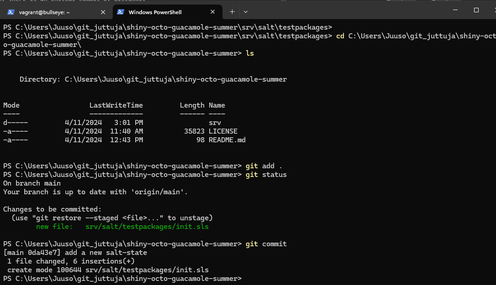
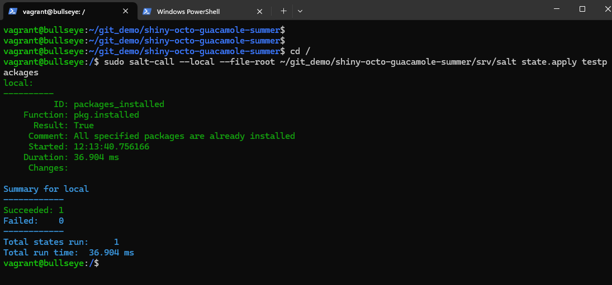
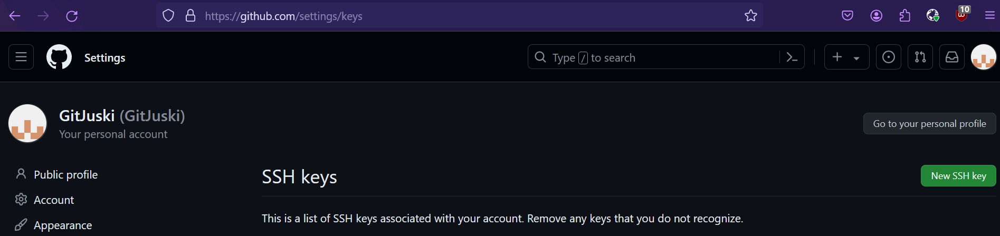

# Introduction

This is the report for homework assignment number three. The assignment is divided into subtasks which are the following:

- Task x. Read and summarize. Only a couple of bullets points are needed per post. The posts are the following:
    - Chacon and Straub 2014: Pro Git, 2ed: 1.3 Getting Started - What is Git?
    - Git usage 'git add . && git commit; git pull && git push'. Explain the individual parts of the command. Use appropriate references.
    - The log of the repo terokarvinen/suolax

- Task a. Online. Create a new repository to GitHub. The name needs to contain the word 'summer'.

- Task b. Dolly. Clone the new repository, make changes locally and push the changes.

- Task c. Doh! Make a stupid change (don't do a commit). Destroy the changes with 'git reset --hard'.

- Task d. Log. Check and analyze the logs of the repository. Verify that your name and email is showing like you want it to.

- Task e. Salted rack. Run salt-states from your own repository.

- Task f. Optional: The other system. Try Git with another operating system.

- Task g. Optional: Collaboration. Give commit access to your friend or your alter ego.

(Karvinen 2024)

## Task x. Getting started - What is Git? Post summarized.

- Git stores and uses information in different way compared to other VCSs (Version Control Systems).
- Other VCSs use a concept called delta-based version control. This means that the systems store the changes as a set of files and changes made to each file over time. In contrast Git stores a state of the file, so, it pretty much stores them as snapshots.
- It is stated that Git is more of a miniature filesystem.
- Most Git operations are done locally which speeds things up. You can work without an internet connection since commits are local. Then the changes can be pushed to the server once you are back online.
- Git checksums everything and nothing can be changed without Git knowing it. The checksum algorithm used is SHA-1 hash.
- Commits to Git are hard to lose.
- Git has three states. These are 1. modified, 2. staged and 3. committed. Modified is a state where changes have been made to a file, but nothing has been committed to a database. Staged is a state where the modified file is marked to go to the next commit. Committed state is a state where the staged data is safely stored in the local database.
- The basic Git workflow starts with 1. modifications to a file in your working tree, then 2. you stage the wanted changes and finally 3. you do a commit.

(Chacon & Straub 2014)

## Task x. Git usage. Commands explained.

- git add . adds the changes made in the current directory to the staging area.
- git commit applies the changes and stores the snapshot locally inside a database.
- git pull pulls the latest snapshot from the remote repository to the local machine.
- git push pushes the locally committed snapshot into the remote repository. So, it publishes it

(Chacon & Straub 2014 && Atlassian s.a)

## Task x. Logs summarized.

- First commit -> Wed Apr 10 19:28:29 2024 +0300. Commit message: Initial commit. Two files: README.md and License. License contains the default GNU GPL 3.0 text. README contains the header suolax and the text 'Run Salt states from version controlled repository'.
- The second commit -> Wed Apr 10 19:29:04 2024 +0300. Commit message: Improve README.md. Removed the header suolax, added the header suolax and also added an empty line after it.
- The third commit -> Wed Apr 10 19:35:49 2024 +0300. Commit message: Add hello world module to create a temporary file. Added four lines into README and added text into two of them. 'To apply "Hello, world!" state' and '$ sudo salt-call --local --file-root srv/salt/ state.apply hello'. Created a new file /srv/salt/hello/init.sls with contents:

      /tmp/hello-salt-from-git:
        file.managed

- The fourth commit -> Wed Apr 10 19:41:45 2024 +0300. Commit message: Add Makefile to apply hello state. Added a new file: /Makefile with contents:

      all:
            sudo salt-call --local --file-root srv/salt/ state.apply hello

- The fifth commit -> Wed Apr 10 19:45:46 2024 +0300. Commit message: Add state to install my favourite apps, currently just 'tree'. Modified makefile by changing this sudo salt-call --local --file-root srv/salt/ state.apply hello into this sudo salt-call --local -l info --file-root srv/salt/ state.apply favourites. Added a new file /srv/salt/favourites/init.sls with contents:

      tree:
        pkg.installed

The sixth commit -> Wed Apr 10 20:02:05 2024 +0300. Commit message: Add more favourite programs, and list installed modules in top file. Modified makefile by removing sudo salt-call --local -l info --file-root srv/salt/ state.apply favourites and adding sudo salt-call --local -l info --file-root srv/salt/ state.apply. Created a file srv/salt/favourites/init.sls with contents:

    favourite-packages:
      pkg.installed:
        - pkgs:
          - git
          - cowsay
          - cmatrix
          - trash-cli
          - wget
          - curl

Added a new file /srv/salt/top.sls with contents:

    base:
      '*':
        - hello
        - favourites

- The seventh commit -> Wed Apr 10 20:04:43 2024 +0300. Commit message: Clean up README.md. Modified makefile by removing sudo salt-call --local -l info --file-root srv/salt/ state.apply and adding sudo salt-call --local -l info --state-output=terse --file-root srv/salt/ state.apply. Modified README by removing $ sudo salt-call --local --file-root srv/salt/ state.apply hello.

- The final commit -> Wed Apr 10 20:55:09 2024 +0300. Commit message: Improve usage instructions. Updated the contents of README by removing Run Salt states from version controlled repository and To apply "Hello, world!" state and adding the following content:

      Run Salt states from version controlled repository.

      Run 'make' to apply all states.

      To learn more Salt, visit https://terokarvinen.com/search/?q=salt

      To see how this repository was created, have a look at 'git log --patch'.

(Karvinen 2024)

# The practical tasks

## Essential information

In addition to this information, I had all updates installed, had 257 GB of free space on my SSD, I wrote the report at home in Vaasa, and I used a wireless connection that was good.

## Task a. Online

I started this task on April 11, 2024 at 11:24 AM.

First, I opened my browser, in this case Firefox. I typed github.com and logged in. 

I opened the profile and repositories where I got the full view of my repositories. I clicked on new.

I gave the repository a name. GitHub recommended an interesting name, so I used it since this repo was for demonstrating purposes only. I made sure that the repo was public. Then I clicked on 'Add a README file' and chose the GNU GPL v3 as the license. Then I clicked on create repository.

The result looked like this.

Here I remembered that the name had to contain the string 'summer' in it, so I needed to rename it.

Here I opened the settings, added the summer string and clicked on rename.

I was done at 11:28 AM.

## Task b. Dolly.

I started this at 11:38 AM.

I opened Windows PowerShell by clicking the icon on my taskbar. I changed directory to a directory where I haad some git repos.

I opened the GitHub in my browser to grab the ssh command. On my repos front page, I clicked code and selected ssh tab. I copied the command.

Inside the correct directory, I used git clone.

Then I used `cd .\shiny-octo-guacamole-summer\`. I opened README with notepad since the changes were small.

I saved the changes and closed the notepad. Then I used `git add .` and to check the changes I used `git diff --cached`.

Then I committed the changes. I added the -m to add the commit message right there. This was the first time trying to use two git commands on the same line. I've always used them separately one at a time. Ran into an error.

Seems like '&&' isn't a valid separator in PowerShell. So, I decided to use a different separator `;`. That worked. I needed to input my private key's passphrase since I added it to enhance security. This is one of those situations where increasing security often decreases the usability and vice versa'.

Then I checked that the changes were really pushed.

Here's the commit.

And here's the commit via CLI.

Here's the username and email I changed yesterday.

I was done at 11:49 AM.

## Task c. Doh!

I started this at 12:10 PM.

First, I made a new directory called doh.

I went there with `cd` and made a file called oopsiefile.

Then I decided that I wanted to add some text in it.

I added the changes and checked the status.

Finally, I reset the changes and checked that the directory was gone.

I was done at 12:19 PM.

## Task d. Logs.

I was back at 12:43 PM.

I made some changes to the README file. Then I added the changed and committed.

Before I pushed the changes, I checked the commit log.

Here we can see the new commit. It shows the commit ID and the (HEAD -> main) shows us that the changes are local. The earlier commit has (origin/main, origin/HEAD). The origin is the remote repo we cloned from and pushed to. The author is the one doing the commits. with `git config --global user.name` and git `config --global user.name` these can be changed. The Date line shows us the date, time, year and time zone. Below that is the commit message. When I made the repo, I created it using the web interface. That's why there is an initial commit by GitJuski.

Then I used `git pull` and `git push`. Here's the log entries after those actions.

The commit is the last commit locally and remotely, hence (HEAD -> main, origin/main, origin/HEAD).

I was done at 12:46 PM.

## Task e. A salted rack

Back from lunch at 2:25 PM.

I wanted to do some tests before doing the real thing. I started by creating a new directory inside my vagrant dir.

I created a vagrantfile with vagrant init.

I opened the file with notepad and added the number 64 just to make sure, since I didn't do it when using vagrant init.

I connected via ssh.

I did the usual.

    sudo apt update && sudo apt upgrade
    sudo apt install ufw
    sudo ufw allow 22/tcp
    sudo ufw enable
    sudo apt install salt-minion
    sudo salt-call --local grains.item osfinger
       

Then I created a new directory and a module.

Inside I created a new init.sls file with `sudoedit init.sls`.

I once again forgot the `-` before pkgs.

I fixed it.

I moved the whole directory to the home directory `sudo mv /srv/ /home/vagrant/`. Then I tried to apply the state without success.

Then I tested with the --file-root. I first tried it with the current dir without success. Then with srv/salt relative path. (Karvinen 2024)

Then I created a MakeFile with `micro MakeFile`. Update April 12, 2024: I noticed that I used base: I got this and the saltstack top file mixed up.

Make didn't work so I checked if it's even installed with `which make`. I installed it.

Some new errors. I renamed the file which got me forward.

The problem was that I used two spaces instead of tabs when indenting so I fixed it (Stackoverflow 2014).

I tried to use make from a different dir without success and then I tried it with the -f flag without success (make manual page). Update April 12, 2024: I got the command `make -f ~/makefile` to work on a different computer and with different content.

At this point I realized that this isn't even part of the assignment, so I stopped playing with make here.

I removed the makefile and the srv/ dir.

I opened a new tab in PowerShell and created a new dir inside the repo.

I created an init.sls file.

I committed and then used `git pull` and `git push`.

I checked that it got pushed.

Then I grabbed the https command.

Back to vagrant. I installed git with `sudo apt install git`. Then I created a new dir and cloned the repo there.

I moved to the new dir and tried the command.

It worked so I removed the packages to test again.

It works as intended.

Tested from another directory.

I was done at 3:14 PM.

## Task f. The other system.

Back at it on April 12, 2024 at 9:40 AM.

I opened PowerShell and started the same vagrantbox I created yesterday.

Updated and demonstrated how to install git.

I removed the repo to demo this from the start.

I lost one of my screenshots where I demonstrated how to install ssh client. `sudo apt install openssh-client` was the command that works.

Here I created a keypair. The -b and a number 4096 configures a key with a length of 4096 bits. The default rsa key is 2048 bits. The one I created is a bit more secure but slower.

Here was the public key.

I wanted to change the comment, so I overwrote the key with a new key.

Then I logged in to my GitHub account and opened the settings. There I selected the keys tab and clicked on 'new ssh key'.

I copied the public key over to the web interface.

Then I opened the repo on the website and clicked on code to copy the ssh command. Here I cloned the repository.

Then I made a change to README with `micro README.md`

Then I tried to push the changes forward. I didn't configure the username and email, so I had to do them before.

Here I changed them.

Then I used the command from earlier. Here's the log after that.

And here's the view from the website.

I was done at 10:06 AM.

## Task g. Collaboration.

I chose to skip this task because it was optional, and none of the people in my circle have a GitHub account.

The commit access can be given from the repo's settings.

Click on add people and input the name, username or email to seach for people.

# References

Atlassian s.a. Commands. Available at https://www.atlassian.com/git/glossary#commands. Read on April 12, 2024.

Chacon & Straub, 2014. Getting Started - What is Git? Pro Git, 2ed. Available at https://git-scm.com/book/en/v2/Getting-Started-What-is-Git%3F. Read on April 12, 2024.

Karvinen, T. 2024. Infra as Code - Palvelinten hallinta 2024. Available at https://terokarvinen.com/2024/configuration-management-2024-spring/.

Karvinen, T. 2024. Suolax. Available at https://github.com/terokarvinen/suolax/. Read on April 12, 2024.

make. manual page. Available with the command `man make`. Read on April 12, 2024.

Stackoverflow asked in 20214, answered in 2014. Question Makefile:2: *** missing separator. Stop. Available at https://stackoverflow.com/questions/23927212/makefile2-missing-separator-stop. Read on April 12, 2024.