# Introduction

This is the report for homework assignment number four. The assignment is divided into subtasks. The tasks are the following:

- Task x. Read and summarize. A couple of bullet points per post. The posts are the following:

    - Salt Vagrant - automatically provision one master and two slaves, parts Infra as Code - Your wishes as a text file and top.sls - What Slave Runs What States by Karvinen 2023.

    - Salt overview, parts Rules of YAML, YAML simple structure and Lists and dictionaries - YAML block structures by Salt contributors.

    - state docs for pkg, file and service. The homework directive states that a glance through is sufficient.

- Task a. Hello sls! Create a hello world state by writing it into a text file.

- Task b. Top. Create a top.sls to run multiple states automatically.

- Task c. Apache easy mode. Install Apache, replace the default site and verify that the demon starts.

    - First, manually by hand
    - Write the state into an sls-file
    - pkg-file-service
    - No need to use watch with the service since the index.html isn't a config file. 

- Task d. SSH. Add a new port for the sshd to listen to.

- Task e. Optional. Install Apache to host a website. The site should be available to localhost. HTML should be inside some user's home directory and a normal user should be able to modify it.

- Task f. Optional. Same as previous but with Caddy instead of Apache.

- Task g. Optional. Same as previous but with Nginx instead of Apache or Caddy.

(Karvinen 2024)

# Written tasks (Task x)

## automatically provision one master and two slaves

COMING SOON...

## Salt overview, parts Rules of YAML, YAML simple structure and Lists and dictionaries

COMING SOON...

## pkg, file and service

COMING SOON...

# Practical tasks

## Essential information

- Latest installed feature update: Windows 11, 23H2

- Location: Vaasa

- Network: Decent wireless connection

- Starting date: April 18, 2024

- Storage: SSD with 255 GB of free space

- Rest of the information down below

## Task a. Hello SLS!

I started this task at 11:21 AM.

I opened PowerShell by clicking the icon on taskbar. I created a new directory inside my vagrant directory. Then I created a new machine config.

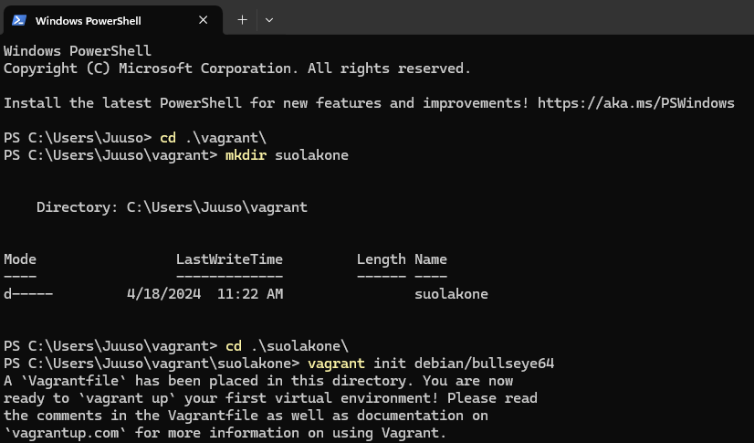

Then I used `vagrant up` to provision the machine. This took a while. The connection reset a couple of times. Once it was done, I used `vagrant ssh` to connect to the new machine. There I did some usual steps.

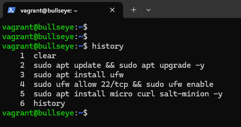

- I usually use the command `clear` instead of `Ctrl + L` since I've found it to be a faster method for me. I wanted to show the history, so I used `Ctrl + L` this time to show a cleaner history. Unfortunately, out of habit, I used `clear` as the first command.

- The second command updated the package repos and upgraded the packages I had.

- The third command installed ufw (uncomplicated firewall)

- The fourth command created a hole for port 22 and enabled the firewall.

- The fifth command installed the following packages: micro, curl and salt-minion.

- The sixth command shows the history.

After this, I created a new directory, changed micro to be the default text editor in this session and created a new file.

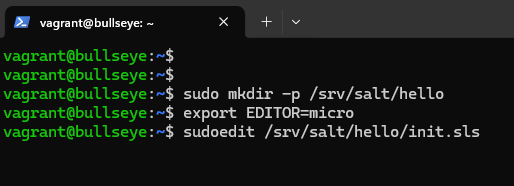

The task says that we are to create a hello world state. I wasn't sure on what kind of state I needed to create. `cmd.run` was an option, but since it is the last resort, I decided to create a `file.state`. This state creates a helloworld file.

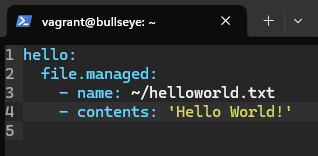

Before this, I tested that the salt-minion worked with `sudo salt-call --local grains.item osfinger`. Then I tested the newly created state.

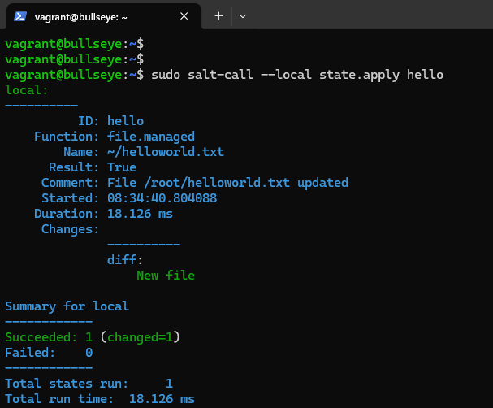

It worked, but I noticed that the file was created inside the root's home directory. At this point I remembered that the salt commands run as root and since I wrote the path like this `~/helloworld.txt` it created the file inside the root's home directory.

I fixed this by writing the absolute path.

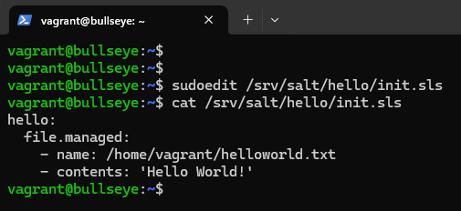

I also changed the micro's color scheme. It can be done like this.

1. Open micro
2. Ctrl + E
3. write: set colorscheme
4. With tab you can browse the available schemes
5. choose one and hit enter

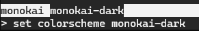

I also removed the earlier file with `sudo rm /root/helloworld.txt`. I tried the fixed state.

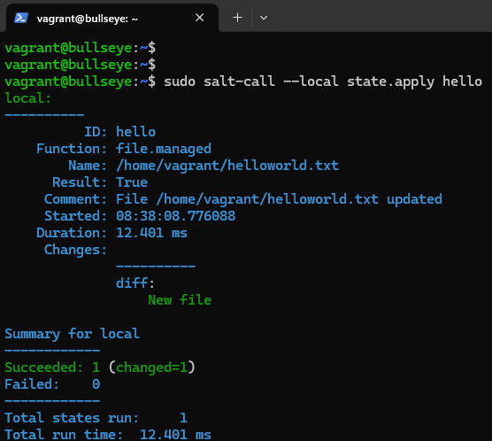

Then I checked the contents.

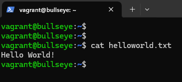

I was done at 11:38 AM.

## Task b. Top.

I started this task at 12:06 PM

I created a top.sls file.

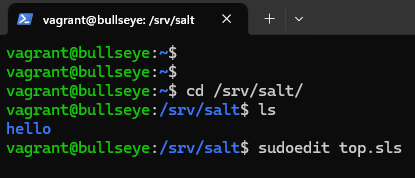

I wrote this.

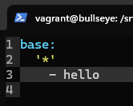

- The first line: base is the place where salt looks for the states stated below.
- The second line: '*' the asterix means that these states will be applied to all minions. A singular minion or a group of minions could be stated here. `'webserver1'` -> states will apply to minion named webserver1. `'web*'` means that the states will apply to minions whose name starts with web.
- The last line is the state or modules to be applied.

The test didn't work.

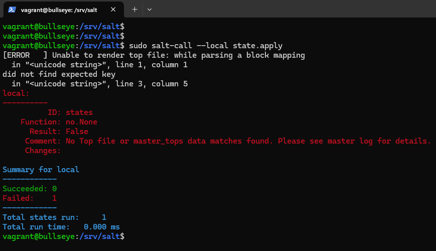

Line 2 had `'*'` instead of `'*':`.

After fixing it, the test worked.

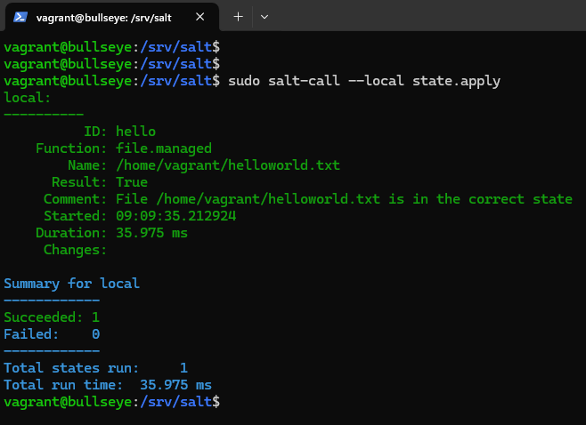

Then I created two new modules. `sudo mkdir tree ssh_state` and `sudoedit tree/init.sls` and `sudoedit ssh_state/init.sls`.

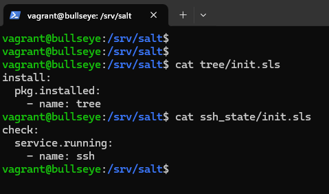

Then I opened the top.sls with `sudoedit top.sls`. I added the new modules.

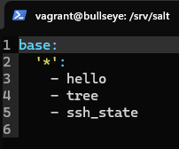

The test didn't produce the wanted output since I apparently used tab instead of spaces.

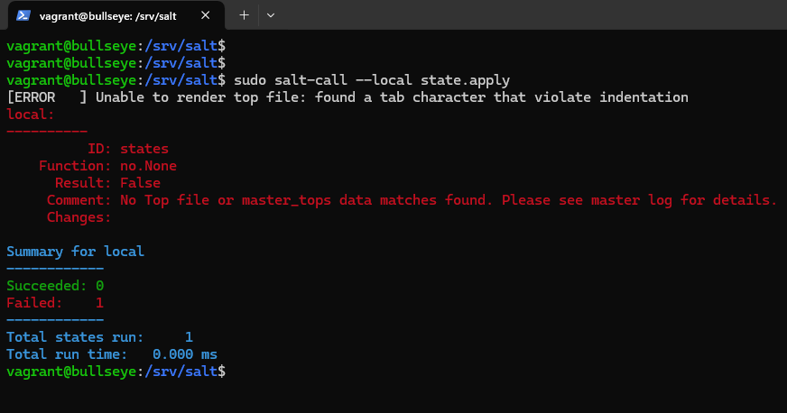

After fixing the indentation, the test was successful.

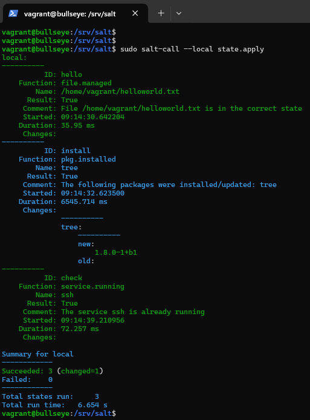

I was done at 12:15 PM

## Task c. Apache easy mode.

I started this task at 12:30 PM.

I created a new directory inside the home directory and created a new config file.

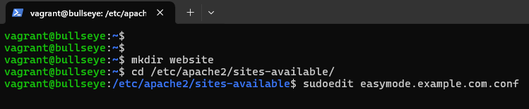

Contents of the config file.

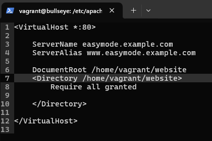

Then I created an index.html inside the newly created directory.

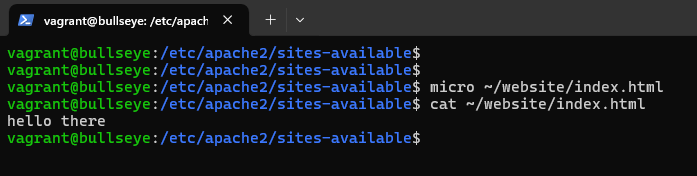

Disabled the old conf and enabled the new conf. Restarted Apache2 demon.

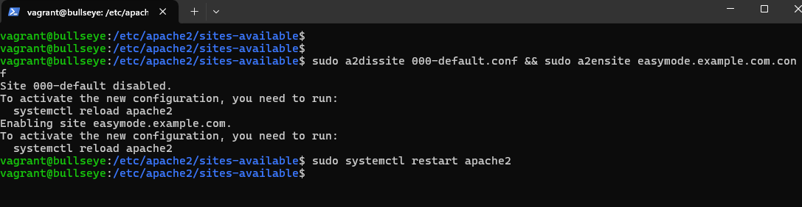

Checked the localhost.

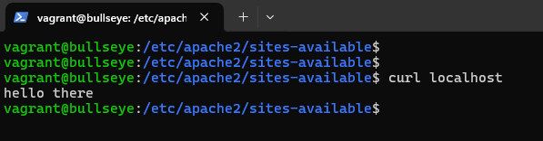

I was done with the manual part at 12:35 PM.

Here I realized that I wasn't supposed to do this much. I only needed to change the default page.

I enabled the old conf again.

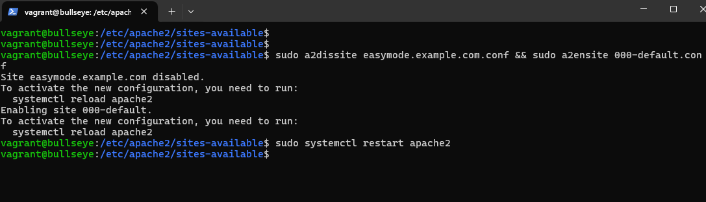

Replaced the default page with text 'default page missing'. Then I checked the results.

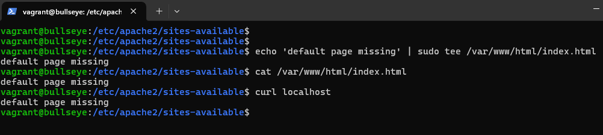

I was done with manual part 2 at 12:37 PM.

After a tiny break, I continued at 12:56 PM.

I started by removing Apache and removing the /var/www/ and /etc/apache2/ directories.

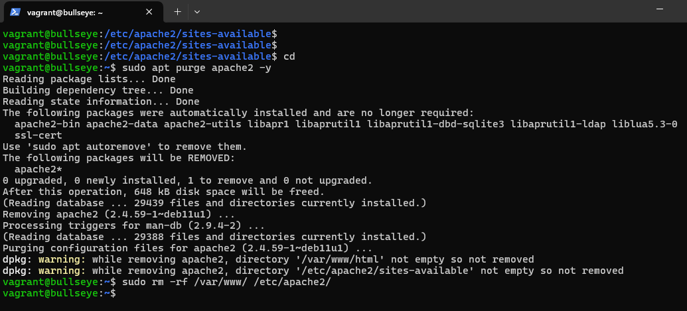

Then I created a new module and a new file.

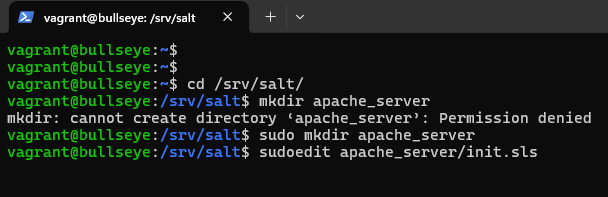

I started off small.

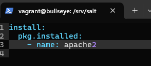

Tested it and it works.

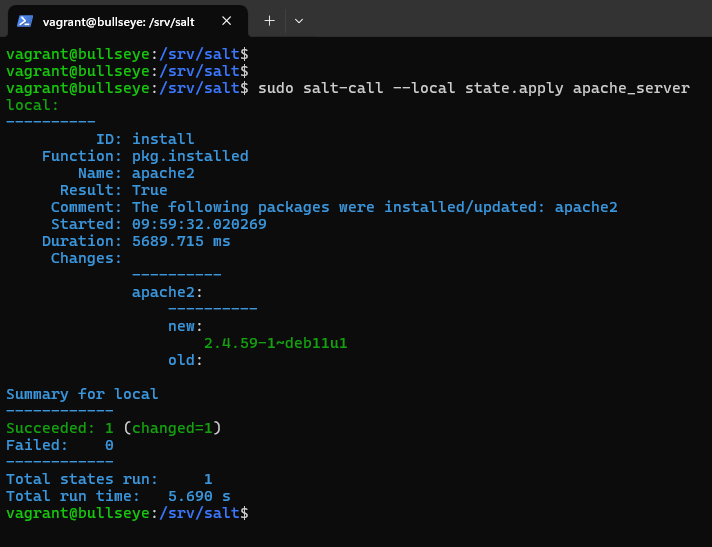

Then I added the file and service states as well.

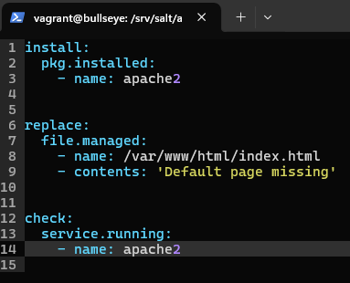

I tested it and it worked. The only thing that changed was the file part. It replaced the contents with the 'Default page missing' text.

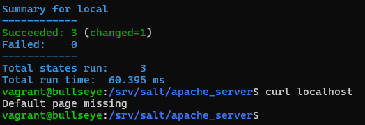

Then I checked that it was idempotent.

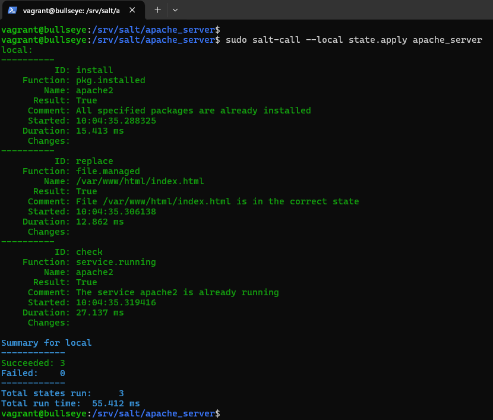

I was done at 1:05 PM.

I wanted to try it without Apache installed so, I used purge once more to remove the demon and deleted the /var/www/ directory.

It worked as intended.

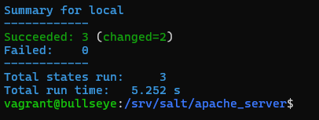

Here's the output: [test_output_h4.txt](miscellaneous/test_output_h4.txt)

## Task d. SSH.

Back in business at 3:26 PM.

Here I demonstrated where to find the file and the part. I've changed a couple of things in the sshd_config before, so this was nothing new to me.

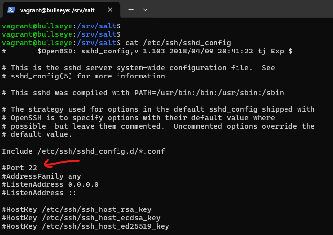

I guess there's a couple of ways to do this. I wanted to make it idempotent, so I took an approach where I just copied the current config and used the copy as a source.

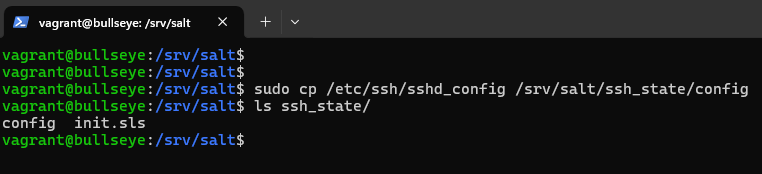

After I copied it, I added a new port after port 22. `sudoedit ssh_state/config`

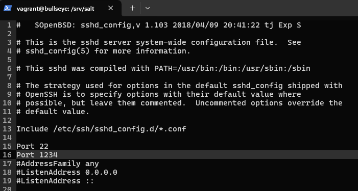

Then I opened the init.sls with `sudoedit ssh_state/init.sls`. I added a new state with the ID configure. Then I modified the other state I had from before.

- The file.managed state here creates an sshd_config file and uses the config file as the source for the contents.

- The service.running state here checks that the sshd service is running and the watch makes it so that the service is restarted when the other state is applied. This means that, when changes are made to the source file the service is restarted.

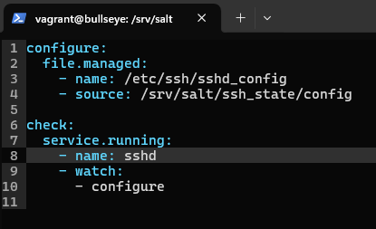

The test was successful.

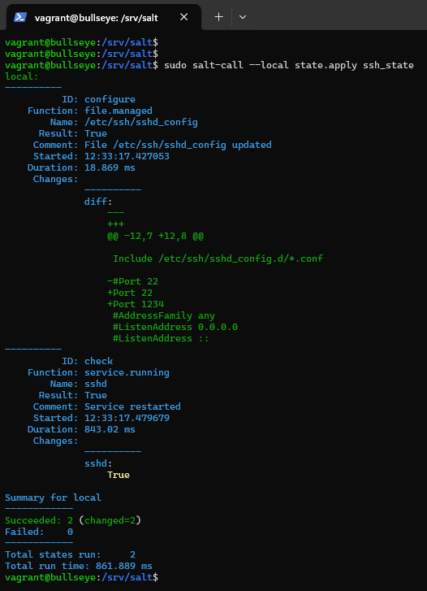

Here I checked that the port was added.

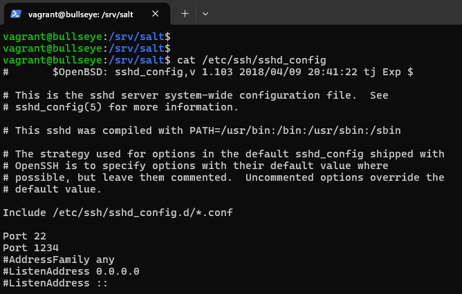

Here I checked the sshd is listening on 1234 and 22.

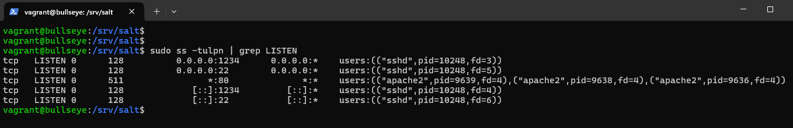

Then I changed removed the port from the source file by editing it with `cd ssh_config/` and `sudoedit config`. Then I tested it again with `sudo salt-call --local state.apply ssh_state`. After the run, I checked that the demon restarted.

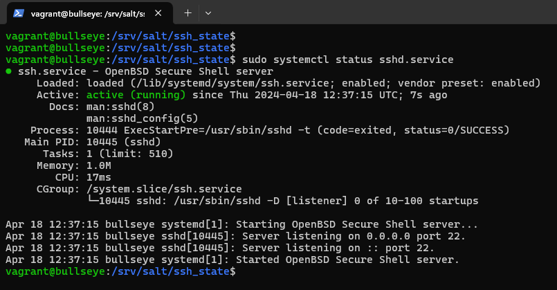

I was done at 3:37 PM.

## Task e. Optional Apache.

I've done something similar to this before this was taught. I wrote a report on it a couple of assignments back. It can be found here https://github.com/GitJuski/Configuration-Management/blob/main/h2-GJ.md#task-f-hello-iac. This was the second homework assignment. I tried to use the new information and adapt to it. The results of this week's task were much better compared to the one before.

I started this at 3:58 PM.

First, I made my way to the module I created earlier. I created a file that I'll be using as a source.

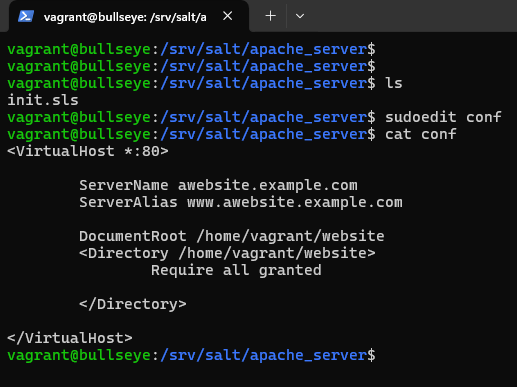

I wrote three states.

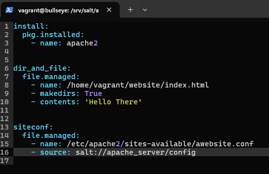

The test was not successful. The problem was that I used config instead of conf as the source.

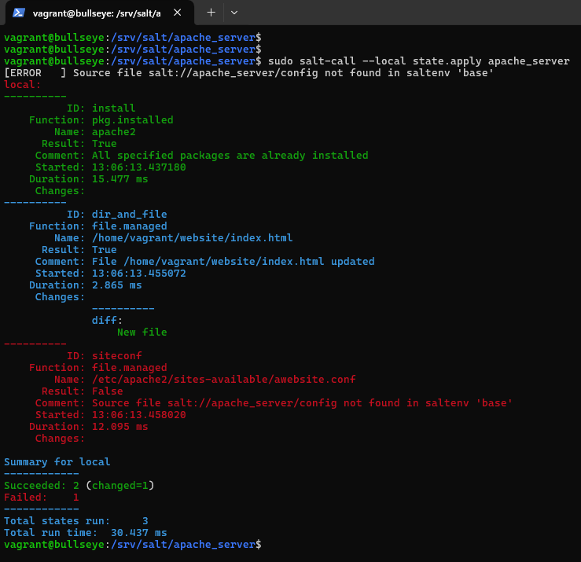

After fixing it the output was good. I checked that the directory and the file was created.

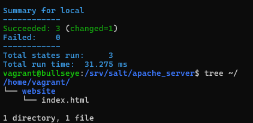

Then I edited the file some more with `sudoedit init.sls`.

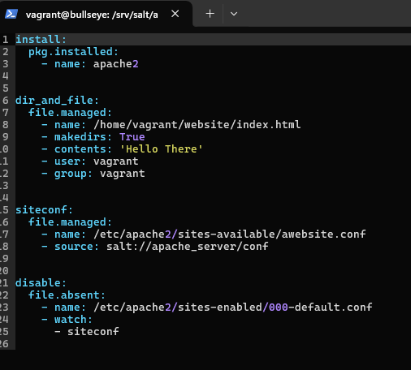

- I changed the user and group to be owned by vagrant on the file.
- I added a state that makes sure that the default conf is disabled. The watch here was unnecessary. I had something in mind that I forgot soon after.

The output was once again good.

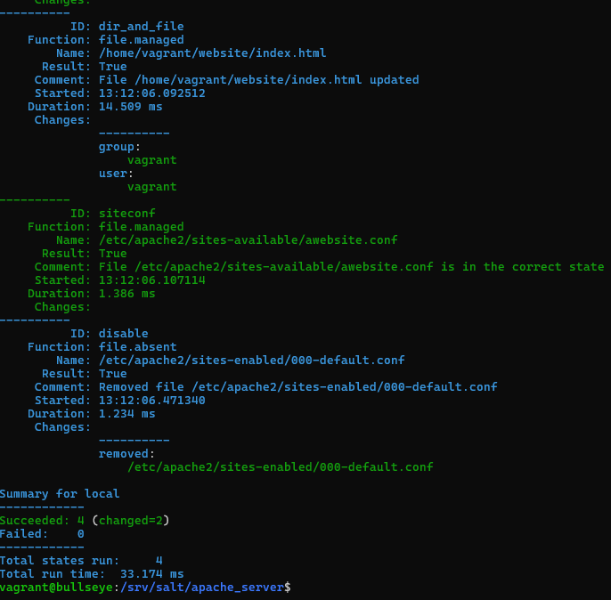

Since I created the website directory for the first time without any thought, I had to change the ownership. I decided to do it by hand. This could be done with salt as well.

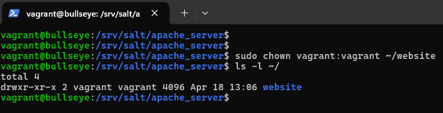

Then I added a state where the correct config is enabled.

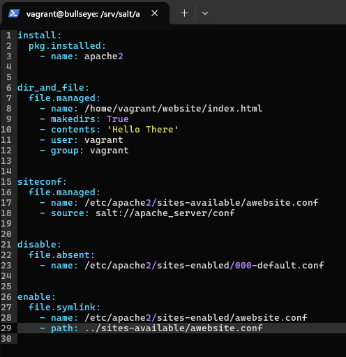

An error occurred.

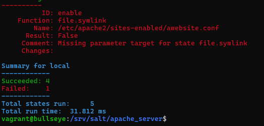

My memory was at fault here. I used `path:` instead of `target:`. I fixed it and it worked.

Then I added the service state. I also gave some other states a watch_in statement (Karvinen 2024). With this the Apache2 demon is restart every time the config is changed, default config is disabled, or the new config is enabled.

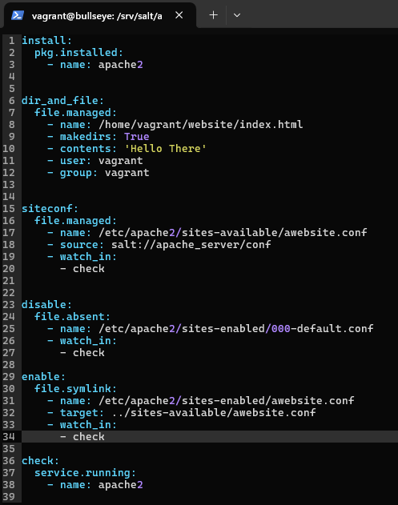

Then I tested my IaC again, starting from a clean slate. I removed Apache with `sudo apt purge apache2`, removed directories and files with `sudo rm -rf /var/www/ /etc/apache2/ ~/website/`. Then I tested it and the results were great.

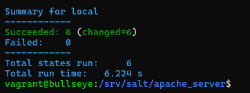

Here's the whole output: [test2_h4.txt](miscellaneous/test2_h4.txt)

And here's the second test where I tested idempotence (Karvinen 2024).

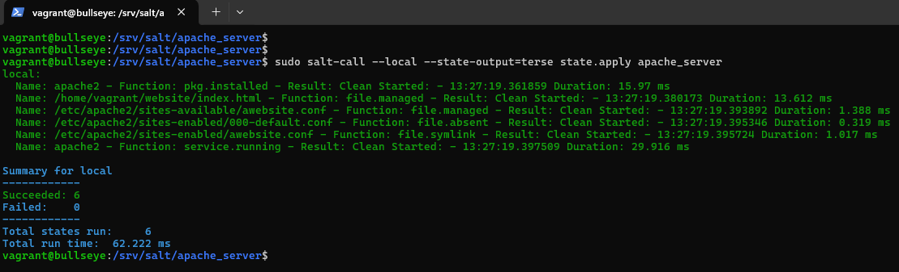

Here I checked the end results.

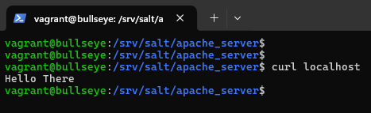

I was done at 4:28 PM

## Task f. Optional Caddy.

I continued my work on April 19, 2024 and I started this task at 12:05 PM. The reporting is straighter to the point for this and the Nginx part because of scheduling constraints.

First, I tried to configure Caddy manually. I opened PowerShell and made my way to the correct dir. I used `vagrant up` and `vagrant ssh` which took a couple of minutes for some reason. This was the same machine (suolakone) I used before. These are the commands I used once I was in.

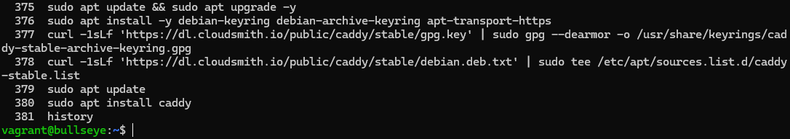

- The first row updated repos and upgraded packages.
- The second row installs the following packages:
    - debian-keyring
    - debian-archive-keyring
    - apt-transport-https

- The third command gets the keyring and stores it.
- The fourth command adds the repo to the apt's sources list
- The fifth command updates the information on this new repo.
- The sixth command installs caddy from the new repo.

I found the steps from Caddy's documentation (https://caddyserver.com/docs/install#debian-ubuntu-raspbian)

At this point I removed Apache with `sudo apt purge apache2` and removed some Apache things with `sudo rm -rf /etc/apache2/`. Then I restarted Caddy with `sudo systemctl restart caddy`. After this, I checked the localhost with curl.

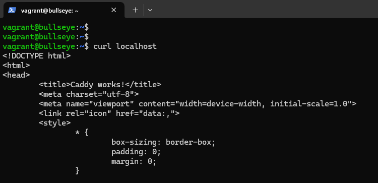

Then I made micro a default editor with `export EDITOR=micro` and opened the Caddyfile with `sudoedit /etc/caddy/Caddyfile`. I needed to make a singular change. I changed the path from the default one to /home/vagrant/website (Tony Teacher, 3:56 min). If you remember from earlier, I had the website directory and index.html already created.

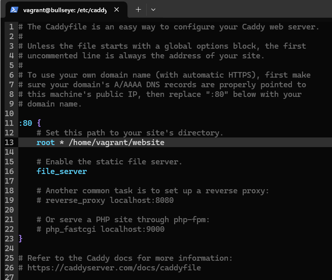

After modifying the file, I restarted caddy and checked the site. I also checked with the `-I` flag to show that the site was hosted by caddy.

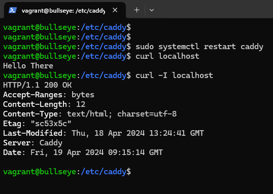

Then I started to work on the IaC file. First, I used `cd /srv/salt/` there I used `sudo mkdir caddy_server` and `cd caddy_server/`. Then I copied the working conf over and named it conf.

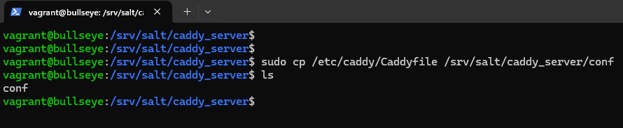

After this I created an init.sls with `sudoedit init.sls`. I created states, state at a time and tested that they work. There were a couple of errors along the way, but nothing impossible to overcome. It was mostly pretty straight forward, like with Apache. I used a reference on the pkgrepo.managed part. I started with cmd.run since I had to get the keyrings and so on, but I wanted to stray away from cmd.run, so I found a reddit post (Reddit 2016) which helped me along the way. This is the end result.

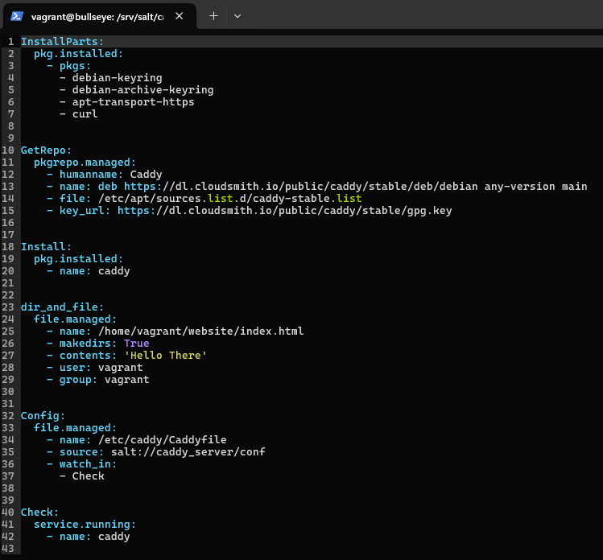

I wanted to test the file, so I removed caddy, /etc/caddy/, ~/website/ /etc/apt/sources.list.d/caddy-stable.list and after these, I removed curl as well to get the 6 out of 6.

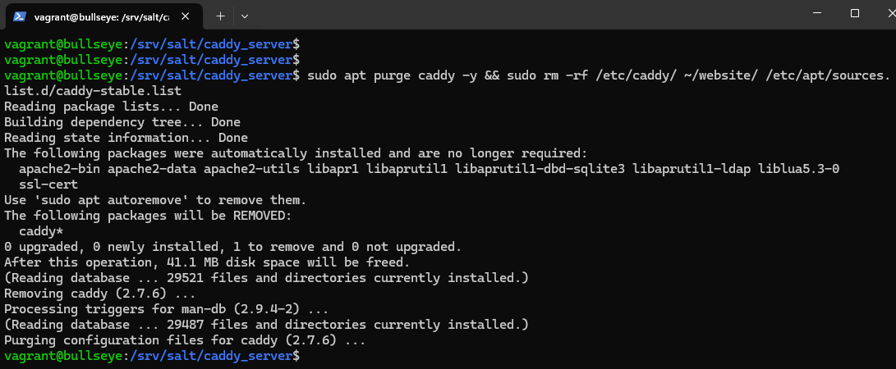

I tried the file with `sudo salt-call --local state.apply caddy_server`.

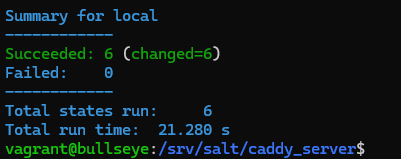

Here's the whole output: [test3_h4.txt](miscellaneous/test3_h4.txt)

I used the file again and it was idempotent. Here's the last curl check.

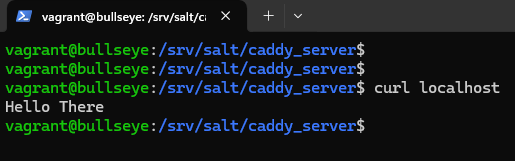

I was done at 12:52.

## Task g. Optional Nginx.

I started this task at 1:59 PM.

These were the first couple of commands I used.

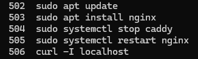

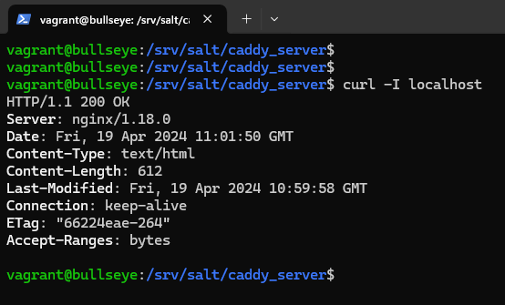

I checked the /etc/nginx/sites-available/default and copied some config from there with modifications. Note: I changed this later on when building the IaC. I created a new conf file `sudoedit /etc/nginx/sites-available/website.conf`.

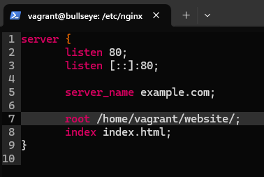

I used `ln -s /etc/nginx/sites-available/website.conf /etc/nginx/sites-enabled/` which I got from here (https://serverfault.com/questions/424452/nginx-enable-site-command)

Then I removed the default, restarted and tested the site.

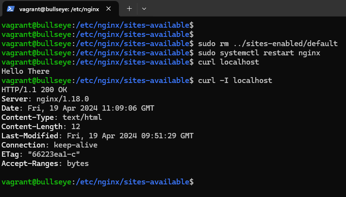

Then I started to work on the IaC file. I copied the conf to be used as a source.

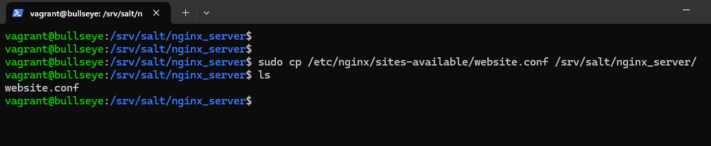

I got the file working at 1:12 PM. I removed nginx and removed some directories to test the file. That's when everything went downhill. Got different errors. Errors like directories missing, config doesn't work etc. I started to troubleshoot. I found out that even manually installing nginx the /etc/nginx/ doesn't appear which caused the directory errors. Then I googled a bit and found out that nginx didn't like that I removed directories by hand. I tried different things until I found these commands (AskUbuntu 2013):

    sudo apt-get autoremove nginx
    sudo apt-get --purge remove nginx
    sudo apt-get autoremove && sudo apt-get autoclean
    sudo find / | grep nginx | sudo xargs rm -rf

Now without a further thought I removed my nginx module as well with the last command since it finds nginx stuff and deletes it. There was a note: "the last command will remove the repository also so you've to add it again by: `sudo add-apt-repository ppa:nginx/stable` (AskUbuntu 2013). I tried using that command but nothing was found. I didn't care about it since this machine is expendable anyways, so I used `sudo apt update` and `sudo apt install nginx`. It finally created the directories. Then I created my IaC file again. This is the final product.

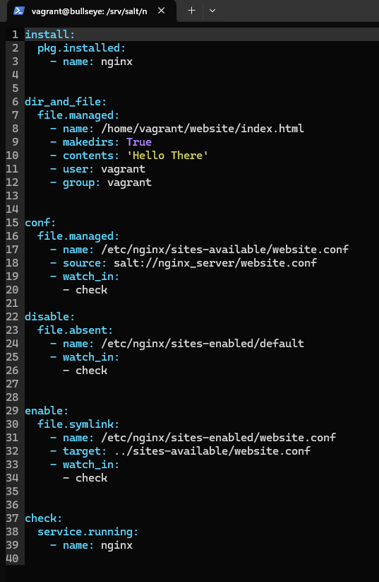

And here's the final version of the configuration file I used as a source.

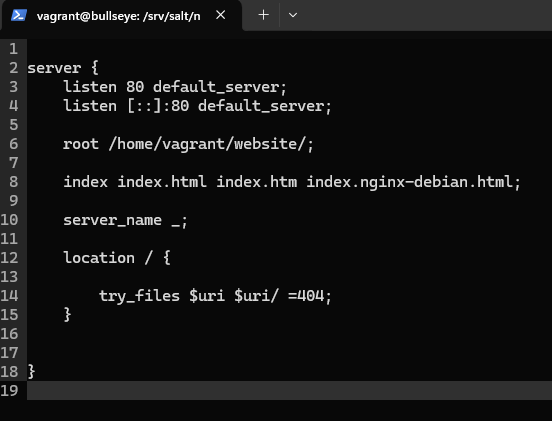

Here's the final tests.

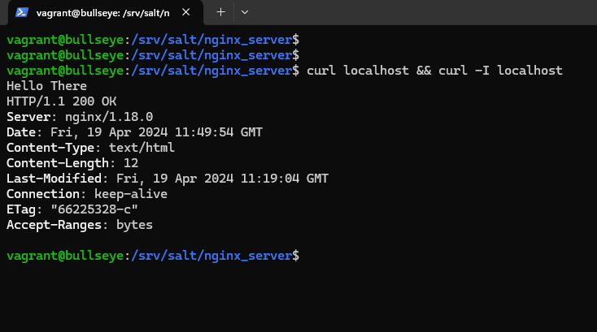

I was done at 2:53 PM

# References

AskUbuntu. Question asked on October 19, 2013 by april. Answer I used as a reference given on October 19, 2013 by Saurav Kumar. how to install nginx after removed it manually. Available at https://askubuntu.com/questions/361902/how-to-install-nginx-after-removed-it-manually. Read on April 19, 2024.

Caddy Documentation. s.a. Install. Available at https://caddyserver.com/docs/install#debian-ubuntu-raspbian. Read on April 19, 2024.

Karvinen, T. 2024. Infra as Code - Palvelinten hallinta 2024. Available at https://terokarvinen.com/2024/configuration-management-2024-spring/.

Karvinen, T. April 17, 2024. Lecture.

Reddit. Question asked on July 16, 2021 by thoughtful-curious. Answer I used as a reference given on July 17, 2021 by contherad. Available at https://www.reddit.com/r/saltstack/comments/olov2m/install_caddy_using_saltstack/. Read on April 19, 2024.

Serverfault. Question asked on September 5, 2012 by HXH. Answer I used as a reference given on September 5, 2012 by pkhamre. Nginx enable site command. Available at https://serverfault.com/questions/424452/nginx-enable-site-command. Read on April 19, 2024.

Tony Teacher. October 27, 2022. How to Make a Simple Caddy 2 Website (with automatic HTTPS). YouTube video. Available at https://www.youtube.com/watch?v=WgUV_BlHvj0. Watched on April 19, 2024.