# Introduction

This is the report for homework assignment number five. As per usual, this assignment is divided into subtasks which are the following:

- Task x. Read and summarize. Choose a homework report from an earlier course and summarize it with a couple of bullet points. The topic is Saltstack on Windows.

- Task a. Install Salt on Windows or Mac. Demonstrate that it works with a command. A demonstration is sufficient if you have it already installed.

- Task b. Gather information from Windows or Mac with grains.items functionality. Choose a couple of key values and analyze them.

- Task c. Try the Salt's file.state on Windows or Mac.

- Task d. Show the files last modified with the find command. The scope here is only limited to /etc/ and /home directories. 

- Task e. Create a Salt state that creates a new command.

- Task f. Optional. Modify the settings of some GUI application. Find the settings inside the file system.

- Task g. Optional. Create a Salt state that creates a directory full of commands. Create the state using recurse parameter so that you don't need to create individual commands/scripts.

(Karvinen 2024)

# The Written task

## Task x. COMING SOON...

COMING SOON...

# Practical tasks

## Essential information

At the time of starting this I was at home in Vaasa. I used a good wireless connection, and I had 257 GB of free space in my SSD. The rest of the information can be read from this image:

## Task a. Install Salt on windows

I started this task on April 25, 2024 at 5:36 PM.

I opened PowerShell as admin by right clicking it and selecting the corresponding line.

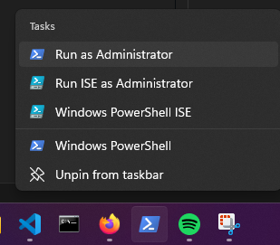

I had to start the salt-minion service since I've set it to not start automatically. I clicked on the Windows key + R to open the run interface. I wrote services.msc and hit enter.

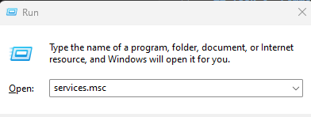

I found the salt-minion and clicked on it. Then on the left I pressed 'Start'.

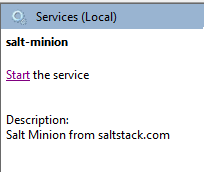

Then I tested that it responds with a simple command.

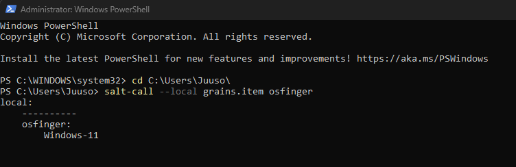

I was done at 5:38 PM.

## Task b. Gather information

I started this task at 5:44 PM.

I started by making my way to a directory I had already created during the last lecture. hello.txt was a leftover from my experimentation with salt.file during the class. Anyway, I wanted to check the options before choosing a couple of items to analyze more in depth. So, I got the whole output with `salt-call --local grains.items` and with `> output.txt` I forwarded the whole thing into a new text file called output.txt.

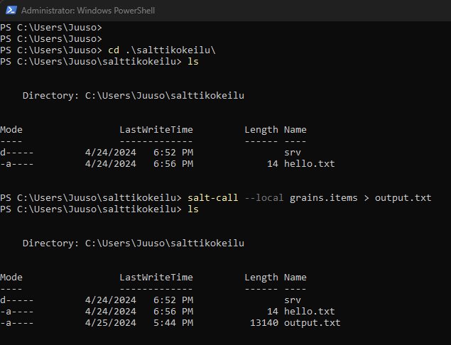

Then I opened the file in VSCode `code output.txt`. I use tab a lot, which is why the command looks like this `code .\output.txt` in the terminal. I read through the file and found a couple of things. To further investigate, I used `salt-call --local grains.item locale_info saltversion shell`.

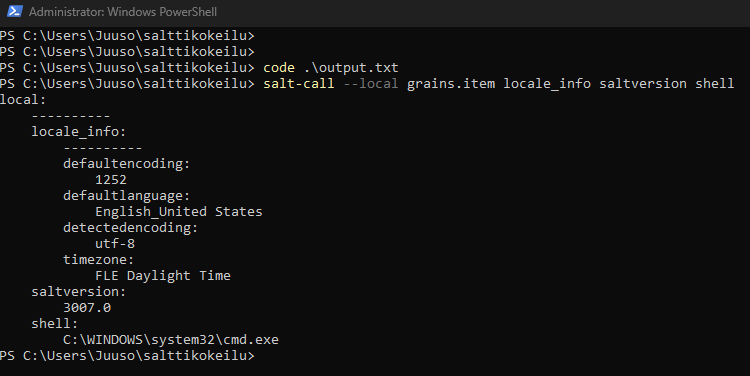

- locale_info shows a couple of things:

    - defaultencoding - > According to a Wikipedia article (edited in 2024) "Windows-1252 is a single-byte character encoding of the latin alphabet" and that "It is the most-used single-byte character encoding in the world". Character encoding is essentially a ruleset for a machine to turn machine language into human language (letters, numbers, special characters etc.)

    - defaultlanguage -> I'm using US-English as my preferred language on my machine.

    - detectedencoding -> This makes me think that the defaultenconding is most of the time if not always Windows-1252 if the OS is Windows. The detected encoding on the other hand tells us that I'm using UTF-8 instead of the default 1252. According to another Wikipedia article (Edited on in 2024) "UTF-8 is a variable-length character encoding standard used for electronic communication.".

    - timezone is the time zone my machine is in. The daylight time probably refers to "Kesäaika" summer time.

- saltversion is the version of salt-minion currently in use. The version 3007.0 seems to be the newest version at this time. The release notes can be found here https://docs.saltproject.io/en/latest/topics/releases/3007.0.html. The version before was 3006.7 (Saltproject 2024).

- shell shows us the default shell which is the cmd (Command Prompt) in this case. Bash is the default on my Linux instances. I really don't use cmd that much. I prefer PowerShell instead.

I was done at 5:48 PM.

## Task c. file.state

I started this at 6:40 PM.

These are the leftovers of the experimentations.

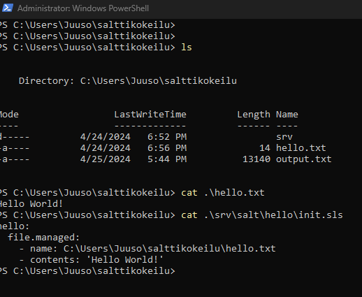

I removed them with `rm hello.txt` and `rm .\srv\salt\hello`. I had to type yes since I didn't use recursive.

I created a new directory with `mkdir .\srv\salt\hello\`. There I created a new file with `code .\srv\salt\hello\init.sls`. I kind of wanted to make a file that gets added and then deleted a minute later. I looked around the net for a bit, but in the end, I just decided to do a simple hello world since I had other things to take care of. Here's the contents.

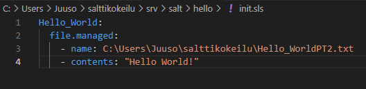

I had changed directory for no reason `cd .\srv\salt`. I tested the file. I copied the paths to avoid human error. It worked as expected.

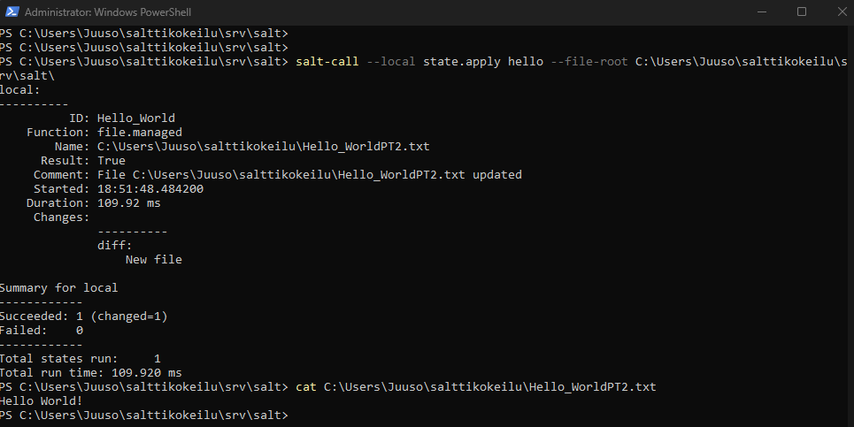

I tested it again to verify idempotence.

I was done at 6:48 PM.

## Task d. Find.

On April 26, 2024 at 11:33 AM I continued.

I opened PowerShell by clicking the icon on my taskbar. I used `cd vagrant/bullseye` to change directories to my bullseye machine's dir. Then I created a machine with `vagrant up`. I kept resetting the connection a couple of times. After a couple of minutes, it was ready. I connected with `vagrant ssh`.

Here I checked the home directory (Karvinen 2024). I decided to use sudo with the find commands to make sure that everything shows up.

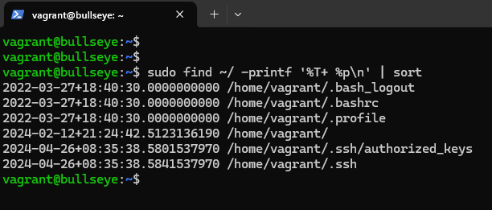

Here I checked the changes in /etc/ (Karvinen 2024). I forwarded the output into a file, so that I could read it later. 

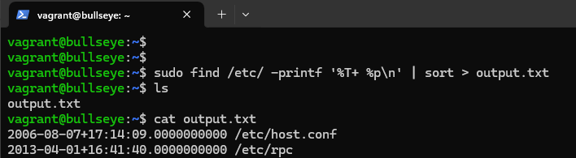

Here I opened the manual page for find with `man find`. I searched for a specific string by opening the search with `/` and typing -printf.

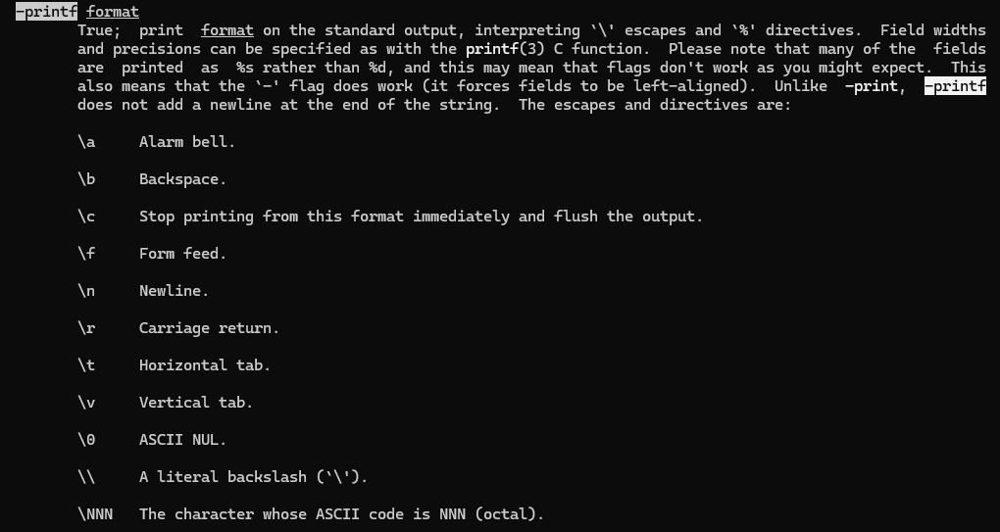

This is the %T line.

This is the %p line.

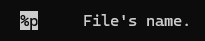

I checked the sort command with `man sort`

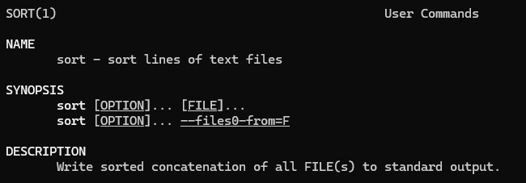

Here are some experiments. The first command is without the sort. The second one is the full command I borrowed from Tero (Karvinen 2024). The last command is without sort and without the newline `\n`.

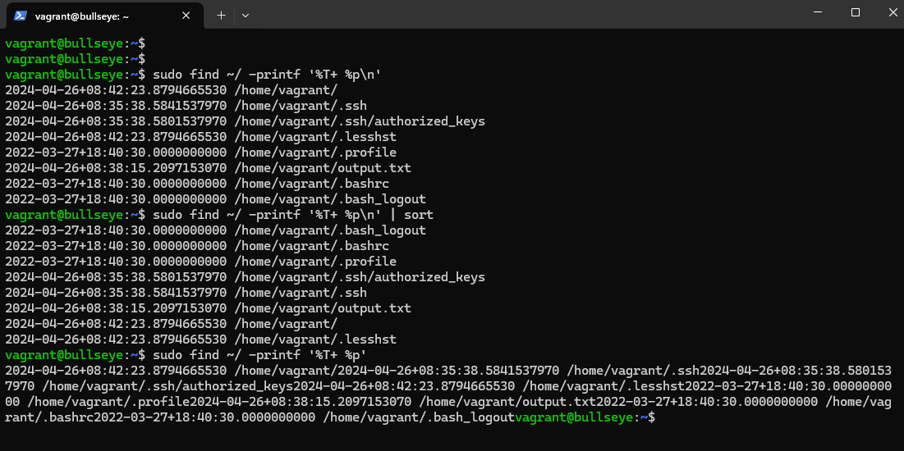

Here I checked the last lines from the output.txt with `less output.txt`.

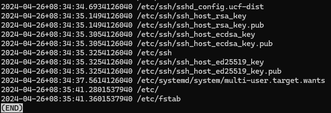

I was done at 11:43 AM.

I decided to continue the research. Here I found a line that describes the %T better.

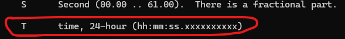

Here's some more experimentation.

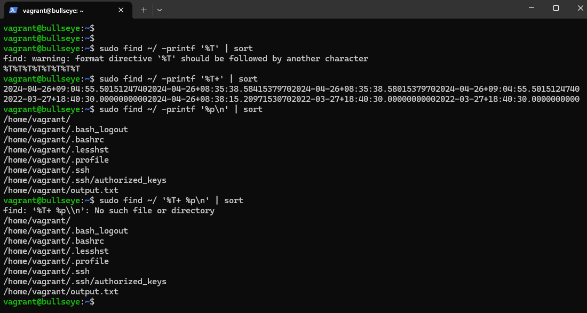

The %T needs the +. So, I did some more experiments.

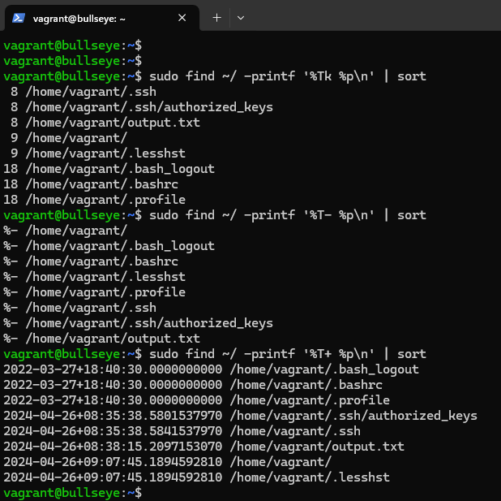

So, my conclusion is this:

- find -> finds something in a specified directory/directories
- -printf -> formats the output by user's choices.
- %T+ -> this is the first choice. Formats the print by last modified time with the year/month/date/time
- %p -> formats the print to show the filename. \n formats every print to go on their own line.
- sort -> sorts the output to be timely correct.

## Task e. Command.

I started at 12:27 PM. 

First, I did some groundwork. 

1. `sudo apt update && sudo apt upgrade -y`
2. `sudo apt install ufw`
3. `sudo ufw allow 22/tcp && sudo ufw allow`
4. `sudo apt install salt-minion`
5. `sudo mkdir -p /srv/salt/command`
6. `cd /srv/salt/command/`
7. `sudo apt install micro -y`
8. `export EDITOR=micro`
9. `sudoedit komento`

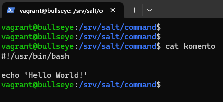

Then I created an init.sls with `sudoedit init.sls`. I created a state that creates a directory and a state that creates a file. The directory and the file are in home directory which is why I made sure that they are owned by vagrant and not root. I checked the file permission numbers from a geeksforgeeks post (2024). I don't use numbers when changing permissions, so I had to check them out. I usually use letters instead. number 755 gives '-rwxr-xr-x' permissions to the file (Geeksforgeeks 2024). User: rwx, Group: rx and Others: rx. 711 would give '-rwx--x--x' permissions (GeeksforGeeks 2024). The leading - means that the target is a file. If it were a directory, then it would look like this 'drwx--x--x'.  

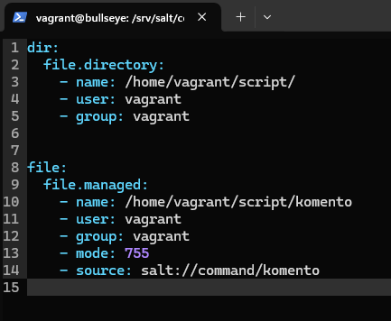

The test worked.

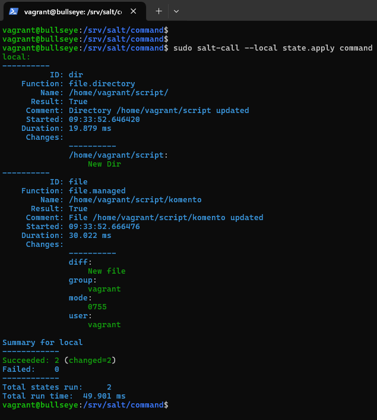

I checked the permissions and tested the command.

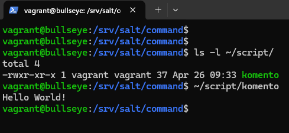

I opened the init.sls with `sudoedit init.sls`. Then I added a new state where the command is made global. Now, the two states before this one are completely optional. The command can be added straight to the /usr/local/bin/ directory. If you want to have a directory of the command in the home directory, then this is the way. This method follows the manual workflow we've been taught. Which goes like this:

1. Create a script.
2. Assign correct permissions
3. Test it
4. Copy it over to /usr/local/bin/
5. Test it

Then I tested it. It created the file with the wrong permissions since I didn't specify the correct permissions.

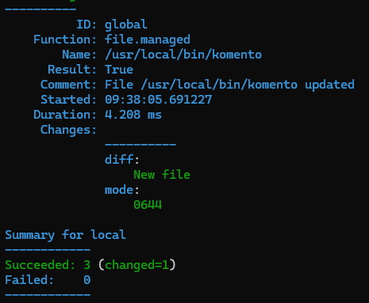

The command doesn't work since I don't have execute permissions.

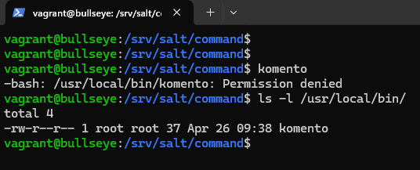

I opened the init.sls and specified better permissions.

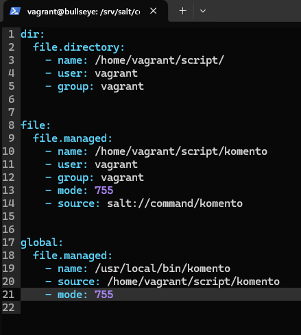

I applied the state once more with `sudo salt-call --local state.apply command`. Then I tested the command and it worked.

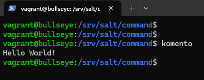

I created a new source with `sudoedit jees`. I opened the init.sls with `sudoedit init.sls` and removed everything except the last state. I made a couple of changes.

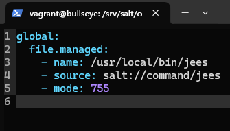

I applied the state and tested it successfully. Here's the command.

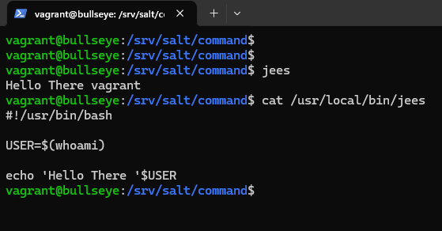

And that's how the command can be created in a single state.

I was done at 12:45 PM.

I decided to test the commands with another user. I created a new user with `sudo adduser testiukko`. I created a password and hit enter multiple times.

I switched to the new user with `sudo su testiukko`. I used sudo so that I didn't need to type the password. I tested the commands and deleted the user.

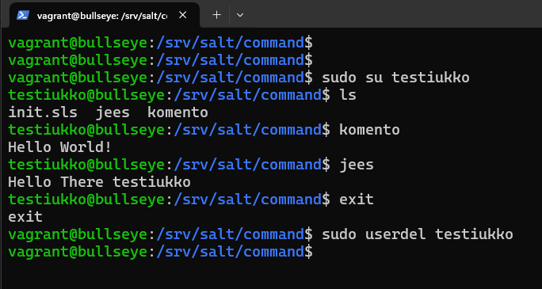

## Optional: GUI.

I started this on April 27, 2024 at 1:33 PM.

I opened VirtualBox application. I selected my main VM and started it.

I logged in and updated/upgraded. Then I tried to install salt-minion with `sudo apt install salt-minion`. It didn't work since the VM is Debian 12. I wanted to do the other optional task with the same machine, which is why I wanted to install the salt-minion. I didn't want to add other sources into this machine, so I decided to switch.

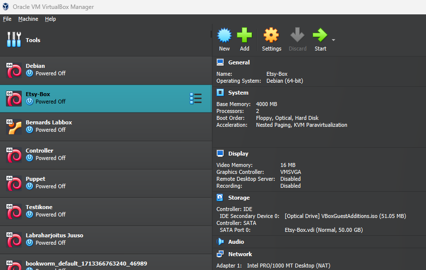

I logged in and did a couple of things:

1. `sudo apt update && sudo apt upgrade -y`

Updates were ready at 1:44 PM.

2. `mkdir /etc/apt/keyrings`

3. `sudo curl -fsSL -o /etc/apt/keyrings/salt-archive-keyring-2023.gpg https://repo.saltproject.io/salt/py3/debian/12/amd64/SALT-PROJECT-GPG-PUBKEY-2023.gpg`

4. `echo "deb [signed-by=/etc/apt/keyrings/salt-archive-keyring-2023.gpg arch=amd64] https://repo.saltproject.io/salt/py3/debian/12/amd64/latest bookworm main" | sudo tee /etc/apt/sources.list.d/salt.list`

The commands 2, 3 and 4 are from a Saltproject's guide (s.a)

5. `sudo apt update`

6. `sudo apt install salt-minion`

7. `sudo salt-call --local grains.item osfinger`

Then I right clicked on the desktop and selected display settings. NOTE that this machine has GNOME instead of XFCE. Then I selected 'appearance' and switched to the default style from the dark style.

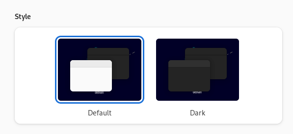

Then I checked if anything changed in the /etc/ with `sudo find /etc/ -printf '%T+ %p\n' | sort | grep 2024-04-27`. Kinda bold of me to assume anything changed there since the settings are user specific. So, nothing related to this there.

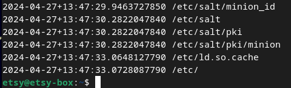

So, next I checked the /home/ with `sudo find /home/ -printf '%T+ %p\n' | sort | grep 2024-04-27`. That looked promising so I decided to forward the output into a new file. I used `sudo find /home/ -printf '%T+ %p\n' | sort | grep 2024-04-27+13:48 > output.txt`. I also added the time I did the changes. Next up I opened the file with `less output.txt`.

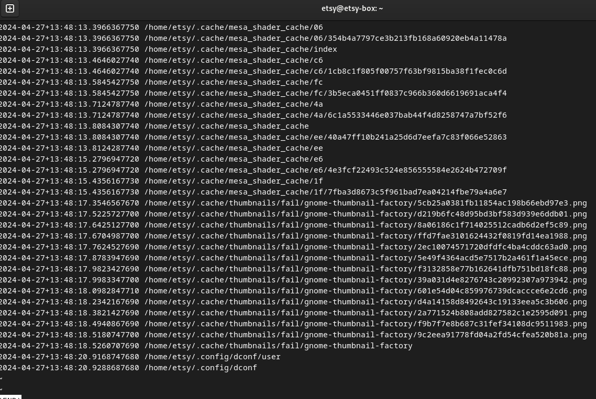

The second to last row looked like something I should look into. The other changes seemed to be in `.cache/` and this one was in `.config` which is why it caught my eye. The one below is the directory.

So, I did the next logical step with `cat /home/etsy/.config/dconf/user`. The file is a binary file, so most of it was unreadable. At the end of the file was readable text but nothing too straightforward. My next step was to check it out a couple of times while changing the style back and forth.

1. `sudo find /home/ -printf '%T+ %p\n' | sort | grep 2024-04-27+13:55 > output.txt`
2. `cat output.txt`
3. `cat /home/etsy/.config/dconf/user`
4. `sudo find /home/ -printf '%T+ %p\n' | sort | grep 2024-04-27+13:57 > output.txt`

At this point I thought that I had found something that might correlate to these changes. My next step was to have them side by side, so I did this: I changed the style to the default and created a copy.

1. `cat /home/etsy/.config/dconf/user > konffi_vaalea.txt`

Then Switched back to the dark theme and:

2. `cat /home/etsy/.config/dconf/user > konffi_tumma.txt`

Then I opened both in their own terminals with `cat konffi_vaalea.txt` and `cat konffi_tumma.txt`. Here's both of them with the lines highlighted.

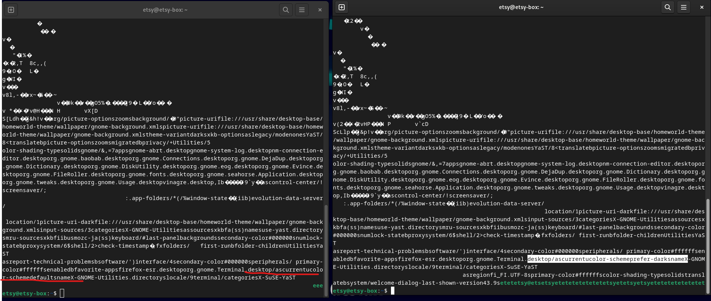

Then I changed the wallpaper by right clicking the desktop, clicking on display settings, selecting the appearance tab and changing the wallpaper.

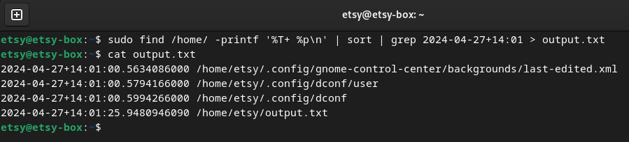

There was an xml file changed so I checked it out with `cat /home/etsy/.config/gnome-control-center/backgrounds/last-edited.xml`. There was nothing interesting in it, so I opened the same file as before. These are the parts I found to be related to the wallpaper.

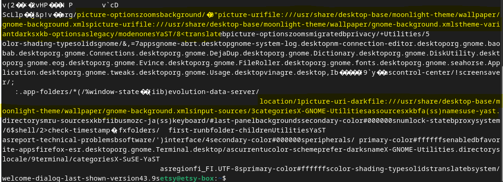

The wallpaper was 'moonlight-theme'. I tried it later with the wallpaper I had on before. Its name was 'homeworld-theme'.

I wanted to check how the xfce handles this. I started another VM.

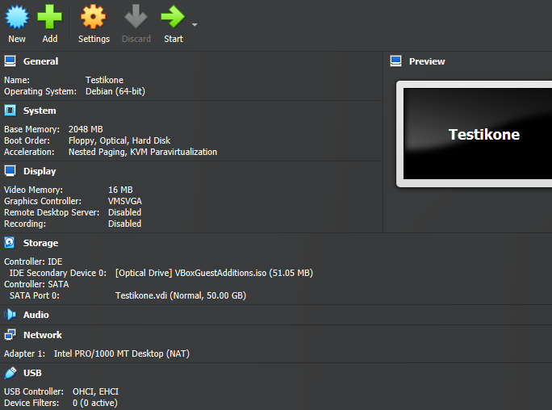

I logged in and used `sudo apt update && sudo apt upgrade`. Then I right clicked on the desktop and selected 'Desktop settings...'. All the wallpapers were pretty much the same, so I decided to try changing the icons. I opened the icons tab and changed the icon size.

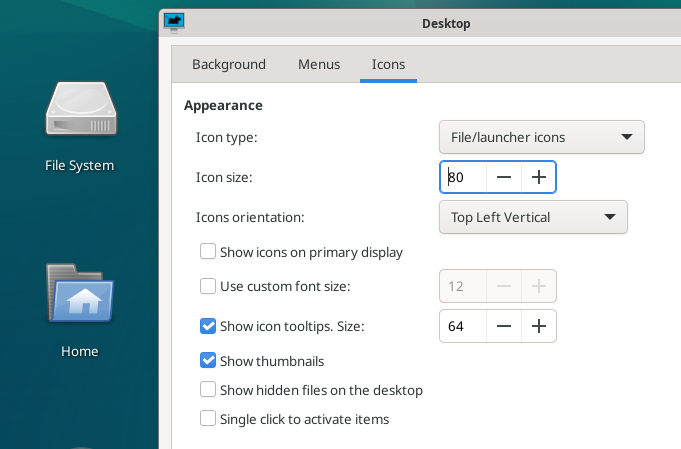

I checked the changed files.

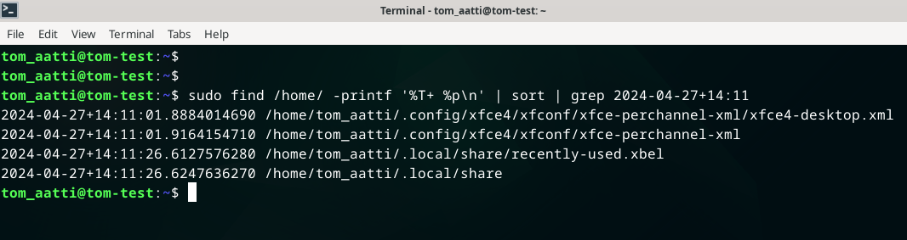

Then I opened the first line's xml file with `less /home/tom_aatti/.config/xfce4/xfconf/xfce-perchannel-xml/xfce4-desktop.xml`. I checked the values and found this at the bottom of the file. the property icon-size has a value of 80. This was it.

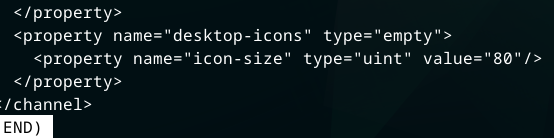

I changed the icon size again with the method I used earlier and checked the file once more. Now the value was 44.

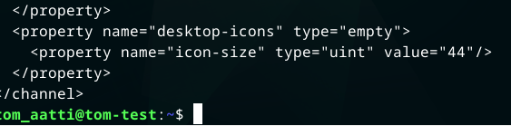

I was done at 2:15 PM.

While I was working on xfce, I remembered a tool called strings. I've tested it in some ctf some time ago. I wanted to demonstrate its use, so I opened the etsy-box again.

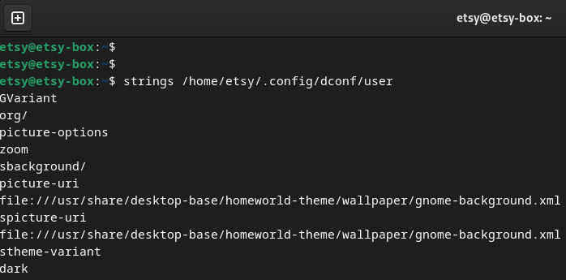

This is a simple use case for strings. It grabs the human readable text from a binary file which makes jobs like these faster and easier. In the image above, we can see the wallpaper called homeworld.

## Optional: A box full of commands.

Saltproject's documentation has a simple example on file.recurse. I read through the example a day before.

I started this task at 3:59 PM.

I started off by creating a module and a directory with three commands.

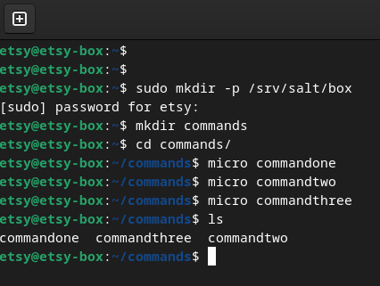

Then I created an init.sls file (Saltproject s.a).

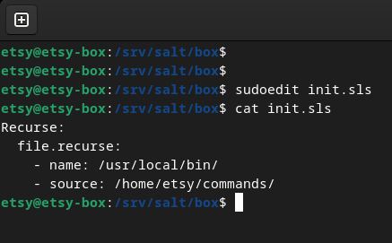

It didn't work and the problem was the source.

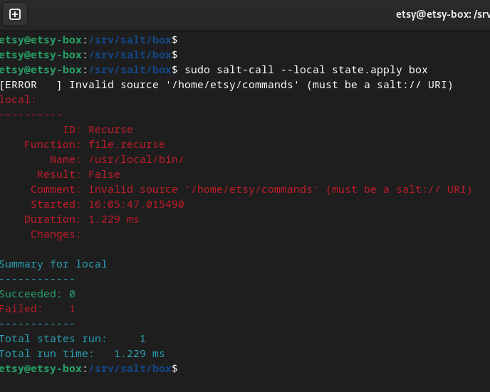

I copied the directory over and made changes to the init.sls.

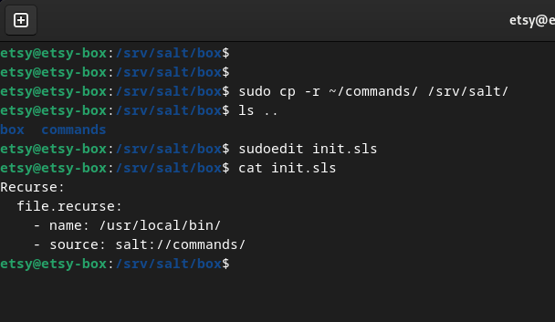

That fixed it.

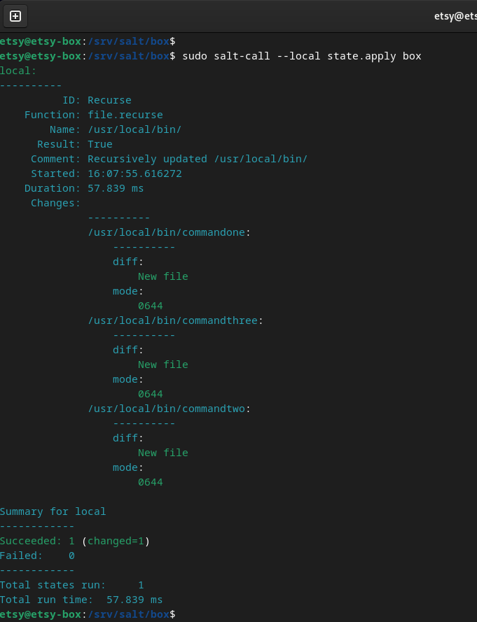

They copied over with 644 permissions.

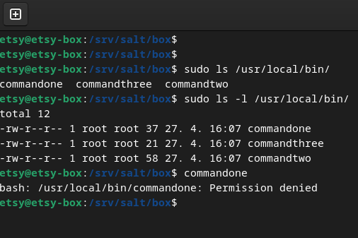

I added the following line to the state: - mode: 755. That didn't work. At this point I had a major case of tunnel vision since I started to read through the documentation again when the answer was right there in the error text. I guess I just read the first sentence ('mode' is not allowed in 'file.recurse'.) and didn't bother reading the rest.

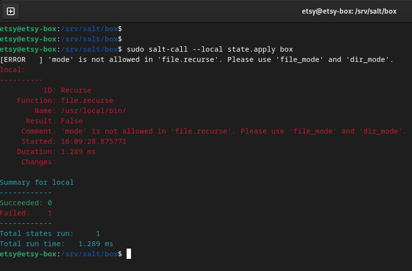

I also wanted to check if the permissions are copied from the source.

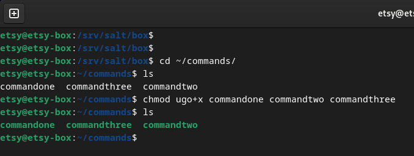

Which was not the case.

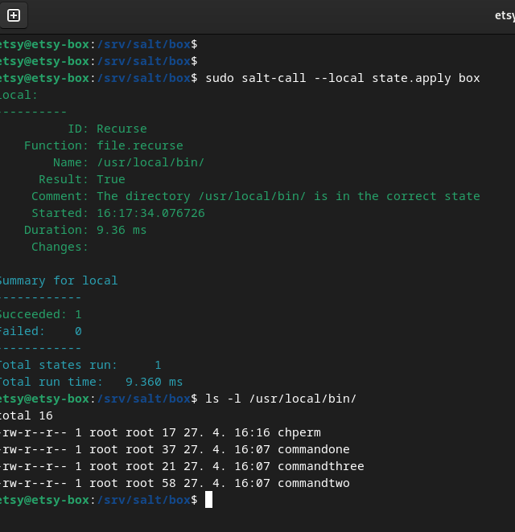

Well, I found the same answer from the docs, so I used - file_mode: 755 (Saltproject s.a).

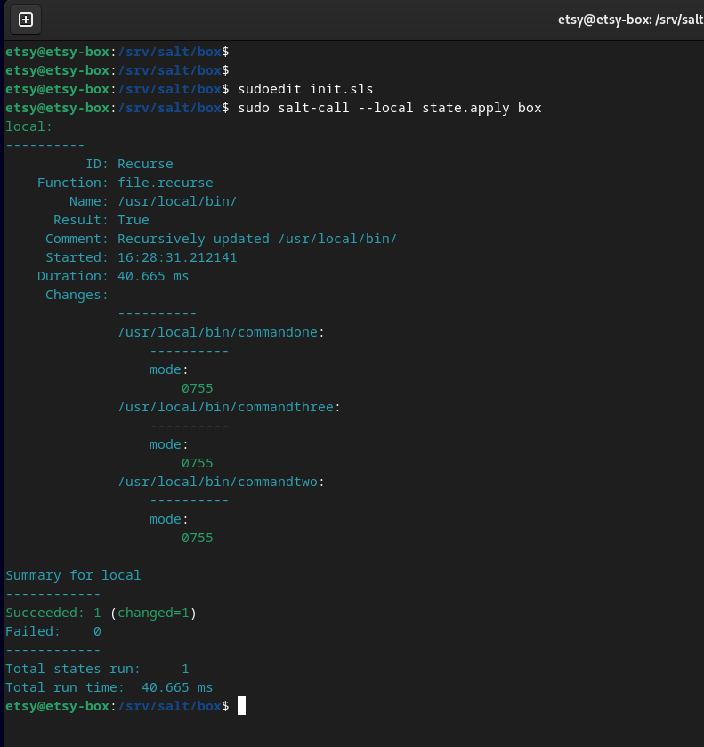

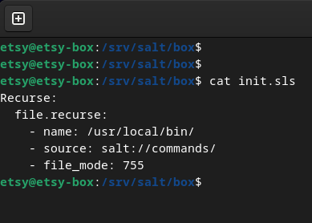

I wanted to give the commands tighter permissions, so I gave them 711.

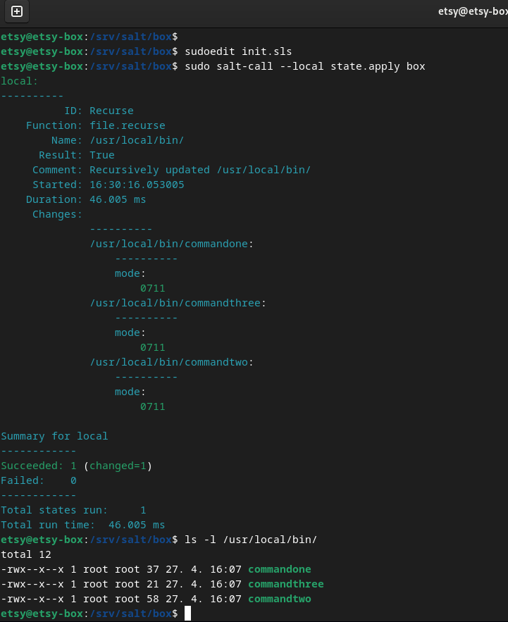

Of course they didn't work then. I got a permission error, so I switched them back to 755. Then I tested the commands.

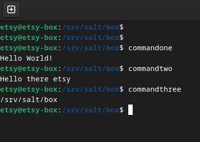

I was done at 4:32 PM.

With file.recurse I can create a directory full of commands and then send them all to a minion machine. This is undoubtedly a powerful state.

I kept reading the docs and found out a different way of changing permission recursively (Saltproject s.a).

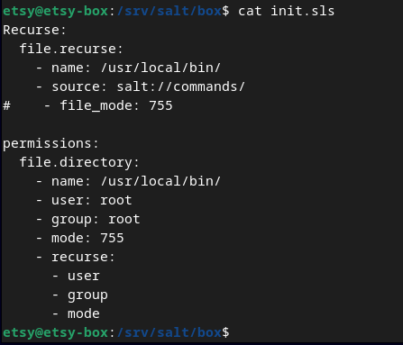

This also works.

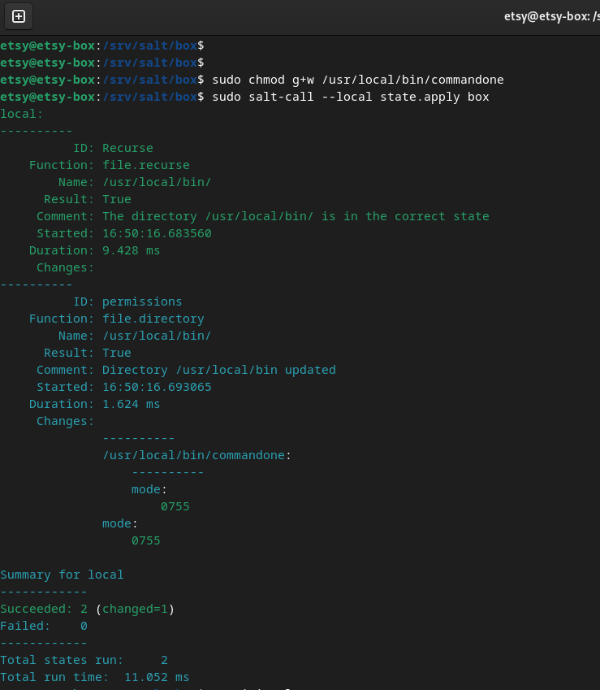

# References

Geeksforgeeks. 2024. How to Set File Permissions in Linux. The "octal notations" image. Available at https://www.geeksforgeeks.org/permissions-in-linux/. Read on April 26, 2024.

Karvinen, T. 2024. Infra as Code - Palvelinten hallinta 2024. Available at https://terokarvinen.com/2024/configuration-management-2024-spring/.

Saltproject. March 6, 2024. Salt 3007.0 release notes. Available at https://docs.saltproject.io/en/latest/topics/releases/3007.0.html. Read on April 25, 2024.

Saltproject. s.a. Debian. Available at https://docs.saltproject.io/salt/install-guide/en/latest/topics/install-by-operating-system/debian.html. Read on April 27, 2024.

Saltproject. 2024. salt.states.file. Available at https://docs.saltproject.io/en/latest/ref/states/all/salt.states.file.html. Read on April 26, 2024.

Wikipedia. Edited on April 2, 2024. Windows-1252. Available at https://en.wikipedia.org/wiki/Windows-1252. Read on April 25, 2024.

Wikipedia. Edited on April 24, 2024. UTF-8. Available at https://en.wikipedia.org/wiki/UTF-8. Read on April 25, 2024.

