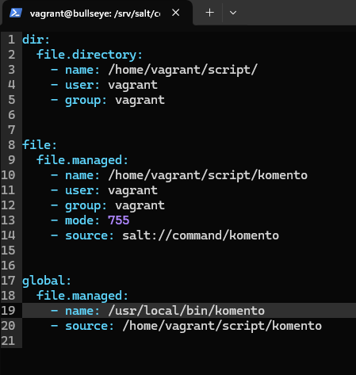

# Introduction

This is the report for homework assignment number five. As per usual, this assignment is divided into subtasks which are the following:

- Task x. Read and summarize. Choose a homework report from an earlier course and summarize it with a couple of bullet points. The topic is Saltstack on Windows.

- Task a. Install Salt on Windows or Mac. Demonstrate that it works with a command. A demonstration is sufficient if you have it already installed.

- Task b. Gather information from Windows or Mac with grains.items functionality. Choose a couple of key values and analyze them.

- Task c. Try the Salt's file.state on Windows or Mac.

- Task d. Show the files last modified with the find command. The scope here is only limited to /etc/ and /home directories. 

- Task e. Create a Salt state that creates a new command.

- Task f. Optional. Modify the settings of some GUI application. Find the settings inside the file system.

- Task g. Optional. Create a Salt state that creates a directory full of commands. Create the state using recurse parameter so that you don't need to create individual commands/scripts.

(Karvinen 2024)

# The Written task

## Task x. COMING SOON...

COMING SOON...

# Practical tasks

## Essential information

At the time of starting this I was at home in Vaasa. I used a good wireless connection and I had 257 GB of free space in my SSD. The rest of the information can be read from this image:

## Task a. Install Salt on windows

I started this task in April 25, 2024 at 5:36 PM.

I opened PowerShell as admin by right clicking it and selecting the corresponding line.

I had to start the salt-minion service since I've set it to not start automatically. I clicked on the Windows key + R to open the run interface. I wrote services.msc and hit enter.

I found the salt-minion and clicked on it. Then on the left I pressed 'Start'.

Then I tested that It responds with a simple command.

I was done at 5:38 PM.

## Task b. Gather information

I started this task at 5:44 PM.

I started by making my way to a directory I had already created during the last lecture. hello.txt was a leftover from my experimentation with salt.file during the class. Anyway, I wanted to check the options before choosing a couple of items to analyze more in depth. So, I got the whole output with `salt-call --local grains.items` and with `> output.txt` I forwarded the whole thing into a new text file called output.txt.

Then I opened the file in VSCode `code output.txt`. I use tab a lot, which is why the command looks like this `code .\output.txt` in the terminal. I read through the file and found a couple of things. To further investigate, I used `salt-call --local grains.item locale_info saltversion shell`.

- locale_info shows a couple of things:

    - defaultencoding - > According to a wikipedia article (edited in 2024) "Windows-1252 is a single-byte character encoding of the latin alphabet" and that "It is the most-used single-byte character encoding in the world". Character encoding is essentially a ruleset for a machine to turn machine language into human language (letters, numbers, special characters etc.)

    - defaultlanguage -> I'm using US-English as my preferred language on my machine.

    - detectedencoding -> This makes me think that the defaultenconding is most of the time if not always Windows-1252 if the OS is Windows. The detected encoding on the other hand tells us that I'm using UTF-8 instead of the default 1252. According to another Wikipedia article (Edited on in 2024) "UTF-8 is a variable-length character encoding standard used for electronic communication.".

    - timezone is the timezone my machine is in. The daylight time probably refers to "Kesäaika" summer time.

- saltversion is the version of salt-minion currently in use. The version 3007.0 seems to be the newest version at this time. The release notes can be found here https://docs.saltproject.io/en/latest/topics/releases/3007.0.html. The version before was 3006.7 (Saltproject 2024).

- shell shows us the default shell which is the cmd (Command Prompt) in this case. Bash is the default on my Linux instances. I really don't use cmd that much. I prefer PowerShell instead.

I was done at 5:48 PM.

## Task c. file.state

I started this at 6:40 PM.

These are the leftovers of the experimentations.

I removed them with `rm hello.txt` and `rm .\srv\salt\hello`. I had to type yes since I didn't use recursive.

I created a new directory with `mkdir .\srv\salt\hello\`. There I created a new file with `code .\srv\salt\hello\init.sls`. I kinda wanted to make a file that gets added and then deleted a minute later. I looked around the net for a bit, but in the end, I just decided to do a simple hello world since I had other things to take care of. Here's the contents.

I had changed directory for no reason `cd .\srv\salt`. I tested the file. I copied the paths to avoid human error. It worked as expected.

I tested it again to verify idempotence.

I was done at 6:48 PM.

## Task d. Find.

On April 26, 2024 at 11:33 AM I continued.

I opened Powershell by clicking the icon on my taskbar. I used `cd vagrant/bullseye` to change directories to my bullseye machine's dir. Then I created a machine with `vagrant up`. I kept resetting the connection a couple of times. After a couple of minutes it was ready. I connected with `vagrant ssh`.

Here I checked the home directory (Karvinen 2024). I decided to use sudo with the find commands to make sure that everything shows up.

Here I checked the changes in /etc/ (Karvinen 2024). I forwarded the ouput into a file so that I could read it later. 

Here I opened the manual page for find with `man find`. I searched for a specific string by opening the serch with `/` and typing -printf.

This is the %T line.

This is the %p line.

I checked the sort command with `man sort`

Here are some experimentations. The first command is without the sort. The second one is the full command I borrowed from Tero (Karvinen 2024). The last command is without sort and without the newline `\n`.

Here I checked the last lines from the output.txt with `less output.txt`.

I was done at 11:43 AM.

I decided to continue the research. Here I found a line that describes the %T better.

Here's some more experimentations.

The %T needs the +. So, I did some more experimentations.

So, my conclusion is this:

- find -> finds something in a specified directory/directories
- -printf -> formats the output by users choices.
- %T+ -> this is the first choice. Formats the print by last modified time with the year/month/date/time
- %p -> formats the print to show the filename. \n formats every print to go on their own line.
- sort -> sorts the output to be timely correct.

## Task e. Command.

I started at 12:27 PM. 

First, I did some groundwork. 

1. `sudo apt update && sudo apt upgrade -y`
2. `sudo apt install ufw`
3. `sudo ufw allow 22/tcp && sudo ufw allow`
4. `sudo apt install salt-minion`
5. `sudo mkdir -p /srv/salt/command`
6. `cd /srv/salt/command/`
7. `sudo apt install micro -y`
8. `export EDITOR=micro`
9. `sudoedit komento`

Then I created an init.sls with `sudoedit init.sls`. I created a state that creates a directory and a state that creates a file. The directory and the file are in home directory which is why I made sure that they are owned by vagrant and not root. I checked the file permission numbers from a geeksforgeeks post (2024). I don't use numbers when changing permissions, so I had to check them out. I usually use letters instead. number 755 gives '-rwxr-xr-x' permissions to the file (Geeksforgeeks 2024). User: rwx, Group: rx and Others: rx. 711 would give '-rwx--x--x' permissions (GeeksforGeeks 2024). The leading - means that the target is a file. If it were a directory then it would look like this 'drwx--x--x'.  

The test worked.

I checked the permissions and tested the command.

I opened the init.sls with `sudoedit init.sls`. Then I added a new state where the command is made global. Now, the two states before this one are completely optional. The command can be added straight to the /usr/local/bin/ directory. If you want to have a directory of the command in the home directory, then this is the way. This method follows the manual workflow we've been teached. Which goes like this:

1. Create a script.
2. Assign correct permissions
3. Test it
4. Copy it over to /usr/local/bin/
5. Test it

Then I tested it. It created the file with wrong permission since I didn't specify the correct permissions.

The command doesn't work since I don't have execute permissions.

I opened the init.sls and specified better permissions.

I applied the state once more with `sudo salt-call --local state.apply command`. Then I tested the command and it worked.

I created a new source with `sudoedit jees`. I opened the init.sls with `sudoedit init.sls` and removed everything except the last state. I made a couple of changes.

I applied the state and tested it succesfully. Here's the command.

And that's how the command can be created in a single state.

I was done at 12:45 PM.

I decided to test the commands with another user. I created a new user with `sudo adduser testiukko`. I created a password and hit enter multiple times.

I switched to the new user with `sudo su testiukko`. I used sudo so that I didn't need to type the password. I tested the commands and deleted the user.

## Optional: GUI.

COMING SOON...

## Optional: A box full of commands.

COMING SOON...

# References

Geeksforgeeks. 2024. How to Set File Permissions in Linux. The "octal notations" image. Available at https://www.geeksforgeeks.org/permissions-in-linux/. Read on April 26, 2024.

Karvinen, T. 2024. Infra as Code - Palvelinten hallinta 2024. Available at https://terokarvinen.com/2024/configuration-management-2024-spring/.

Saltproject. March 6, 2024. Salt 3007.0 release notes. Available at https://docs.saltproject.io/en/latest/topics/releases/3007.0.html. Read on April 25, 2024.

Wikipedia. Edited on April 2, 2024. Windows-1252. Available at https://en.wikipedia.org/wiki/Windows-1252. Read on April 25, 2024.

Wikipedia. Edited on April 24, 2024. UTF-8. Available at https://en.wikipedia.org/wiki/UTF-8. Read on April 25, 2024.

