# Introduction

This is the report for homework assignment six. As per usual, this assignment is divided into subtasks.

- Task x. Read and summarize. Salt Windows package manager (https://docs.saltproject.io/en/latest/topics/windows/windows-package-manager.html). Parts: Introduction, Install libraries, Populate the local Git repository, Update minion database, Install software package, Usage.

- Task a. Install software to Windows or Mac with SaltStack's pkg.installed function.

- Task b. Search for three to seven configuration management projects from earlier courses. The module should be modern centralized management which means that it's idempotent, it utilizes IaC and the term "singular truth applies". This task doesn't require practical testing. This is more focused on evaluating others' work.

    - Business purpose. How can this be beneficial?

        - Like this (Business purpose): "A robot delivers soda from the fridge to me."
        - Not like this: "ESP32 and Arduino control servos, which dodge objects with LIDAR using a C++ program; the gripping component utilizes a PDI controller..."

    - License.

        - The name of the license.
        - Where can the license be seen.
        - What does the license mean and what is the juridical effect.

    - Creator and the year made.

    - Dependencies: Platform (Operating system, cloud...), network environment etc.

    - Interesting.

        - Useful results
        - interesting technique

    - Open questions and/or other notes.

- Task c. Run state made by someone else.

    - Choose a module from task b. Justify your choice.

    - Check the code.

        - Does it download binaries? Does it download from outside the package manager? Are the sources reputable?

    - Run the code.

    - Test the end result.

    - Take screenshots moderately.

    - Comment and evaluate the module.

    - No need to fix all the found bugs. The purpose is to run the module and comment on it.

    - If a module doesn't seem to work, report your tests and try a different module.

- Task d. List five ideas for your own module. The module should have a purpose, but it doesn't have to solve any real business problem. One sentence per idea.

(Karvinen 2024)

# Task x. Salt's Windows package manager summarized.

- Salt has its own Windows package manager solution. It has a software repository and a package manager. It imitates package manager such as yum and apt.

- The repository is full of package definition files which are normal .sls YAML/JINJA2 files that have all the directives for a software install. The files contain the following:

    - Name of the software
    - Version of the software
    - Download location
    - Command-line switches for silent install and uninstall
    - Whether or not to use the Windows task scheduler to install the package

- The repository does not come with salt by default. That's why the GitHub repository must be cloned first. The repository ([salt-winrepo-ng](https://github.com/saltstack/salt-winrepo-ng)) contains a wide array of these package definition files maintained by SaltStack and the salt community.

- `pkg.install` can be used to install a package. `pkg.installed` checks if the package is already installed first.

- Dependencies must be managed manually while using Salt's Windows package manager.

- Install GitPython or pygit2. This step is optional.

## To populate the local Git repo:

    salt-run winrepo.update_git_repos

or in masterless mode

    salt-call --local winrepo.update_git_repos

## To update the minion database:

    salt -G 'os:windows' pkg.refresh_db

or in masterless mode

    salt-call --local pkg.refresh_db

## To install a software package:

    salt * pkg.install 'firefox_x64'

or in masterless mode

    salt-call --local pkg.install "firefox_x64"

## List installed packages:

    salt -G 'os:windows' pkg.list_pkgs

or in masterless mode

    salt-call --local pkg.list_pkgs

- The software name indicates whether it is managed by salt. The name is usually single-word and lower-case name if it is managed by salt.

## List available versions

    salt winminion pkg.list_available firefox_x64

or in masterless mode

    salt-call --local pkg.list_available firefox_x64

## Install a different version than the latest

    salt winminion pkg.install 'firefox_x64' version=74.0

or in masterless mode

    salt-call --local pkg.install "firefox_x64" version=74.0

- The full name can also be specified

      salt winminion pkg.install 'Mozilla Firefox 17.0.1 (x86 en-US)'

    or 

      salt-call --local pkg.install "Mozilla Firefox 17.0.1 (x86 en-US)"

## Remove a package

    salt winminion pkg.remove firefox_x64

or in masterless mode

    salt-call --local pkg.remove firefox_x64

The whole task x's reference (Saltproject 2024)

# Task a. pkg in Windows.

## Essential information

I used a different computer than I normally use. Here's the specs:

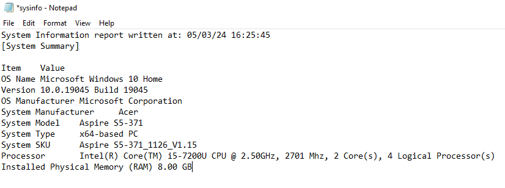

In addition to this, I had 142 GB of free space in my SSD, I was at home in Vaasa and I used a good wireless connection.

I started this on May 3, 2024 at 4:38 PM.

I opened PowerShell in administrator mode by right clicking the icon on my taskbar and selecting 'run as administrator'. Then I created a new directory which I didn't even use in this task.

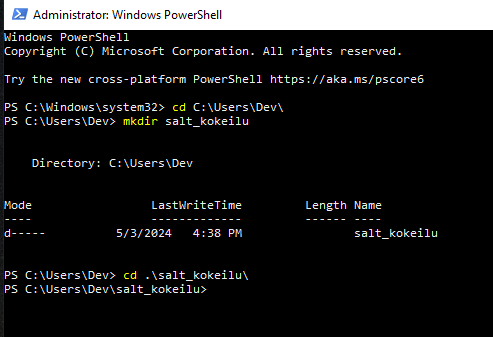

I cloned and updated the winrepo, and after those procedures I installed Wireshark (Saltstack 2024).

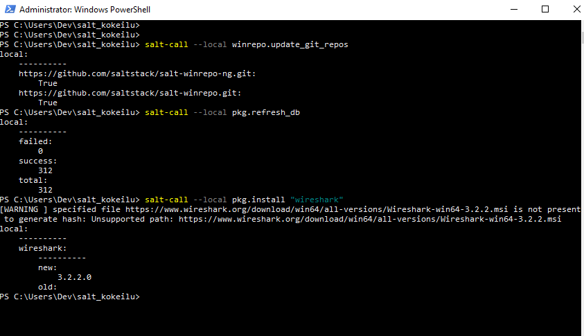

Then I tried `salt-call --local pkg.list_pkgs` (Saltproject 2024). The list was longish so I took a screenshot that shows the newly installed Wireshark.

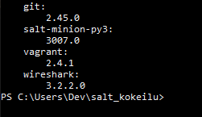

Then I wanted to check the available versions for curl (Saltproject 2024).

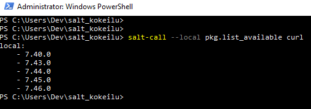

I tried pkg.installed to verify idempotence. pkg.installed wasn't available, so I was bamboozled. I decided to move on.

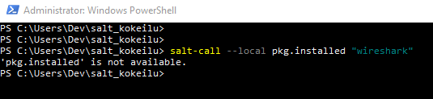

I remember reading that this "package manager" solution doesn't manage dependecies or additional needed tools. I surffed to check the tools that Wireshark needed to work. Without npcap capturing live traffic is not possible (Wireshark s.a). I remember seeing npcap before since I've installed Wireshark some time ago.

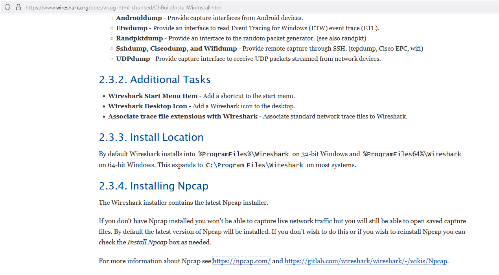

I decided to check if the winrepo had npcap, but they had winpcap instead.

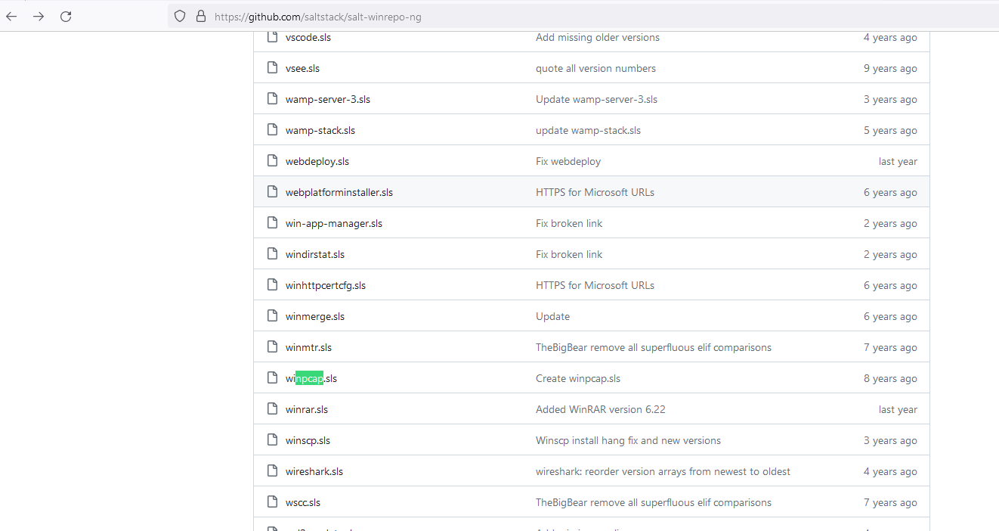

I googled and found a question people asked and the answer to said question.

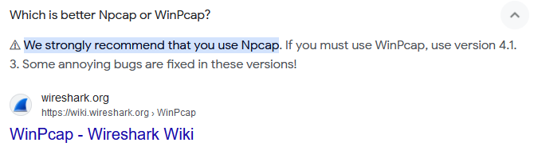

I opened the Wireshark page from before and opened the link to npcap's site. There I scrolled down to downloads and downloaded the installer for Windows.

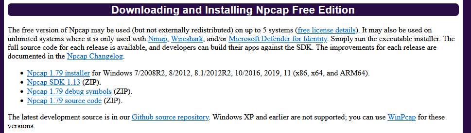

I did the install by clicking next a couple of times. Then I manually searched for the Wireshark.exe since I completely forgot that the Windows search function exists.

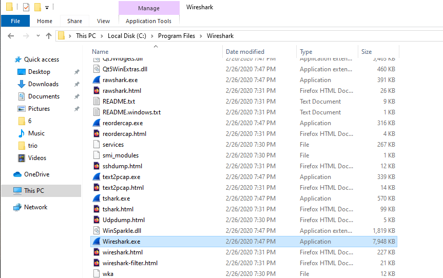

I opened the application and found out that there's an update. Huh..? I thought that Salt installed the newest version. Later on I checked the versions available with `salt-call --local pkg.list_available wireshark`. Version 3.2.2 was the latest available in the repo. The latest version of Wireshark was version 4.2.4 at the time writing this.

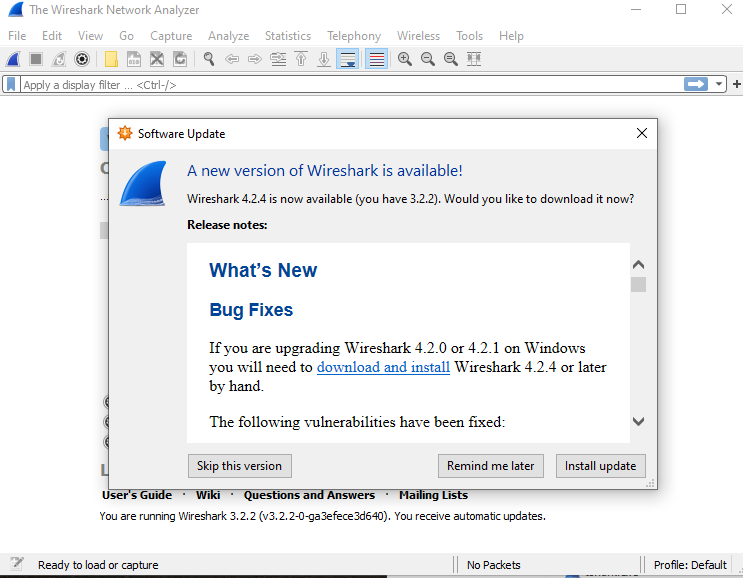

Anyways, I clicked on 'remind me later' since I removed Wireshark later. This was the outlook.

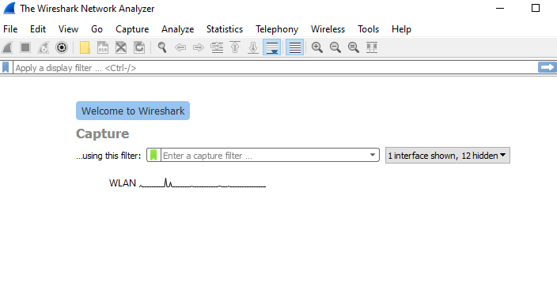

Then I removed Wireshark (Saltproject 2024) and checked that it wasn't in program files anymore.

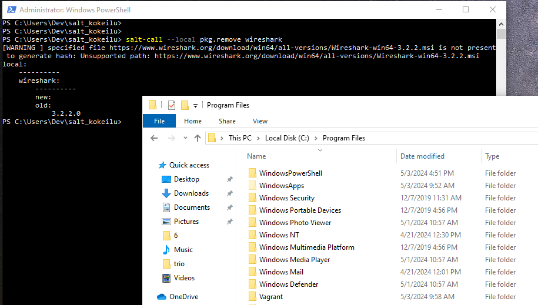

I was done at 4:57 PM.

# Task b. Benchmark.

## Vagrantgoat by Aatu Horelli https://github.com/aatuhorelli/vagrantgoat/

- Business purpose -> Configures a practice environment for testing vulnerabilities.

- License.

    - License name -> GNU General Public License v3.0
    - Where located -> https://github.com/aatuhorelli/vagrantgoat/blob/main/LICENSE
    - Juridical effects:

        - Permissions -> Commercial use, Modification, Distribution, Patent use and Private use

        - Limitations -> Liability and Warranty

- Creator and year created -> Aatu Horelli, 2023

- Dependencies/Requirements:

    - Host machine -> A Linux machine.
    - Tools needed on Host -> Vagrant (VirtualBox), wget and salt-master
    - Environment -> Local
    - Need to manually adjust IP addresses to make it work

- Interesting -> The result is an interesting and useful environment for practice. I liked the usage of scripts with salt modules.

- Open questions and other notes:

    - A good point, as suggested by Aatu is that to make testing more secure, one would want to disconnect the host machine from the internet as well.

## LAMP by Sari Linsen https://github.com/SariLinsen/LAMP/

- Business purpose -> Installs Apache, MariaDB and Python, and changes the default page of Apache2. This creates an environment for practice and development purposes at home. In production use, the webserver and database shouldn't be hosted in the same machine.

- License:

    - License name -> GNU General Public License v3.0
    - Where located -> https://github.com/SariLinsen/LAMP/blob/main/LICENSE
    - Juridical effects:

        - Permissions -> Commercial use, Modification, Distribution, Patent use and Private use

        - Limitations -> Liability and Warranty

- Creator and year created -> Sari Linsen, 2022

- Dependencies/Requirements:

    - Platform -> The packages/tools will be installed on the machine in use. A virtual machine is recommended. If you want to utilize script.sh, then you should use a Linux machine and preferably a VM. To use this on a Windows machine, you need to manually do the installations etc.
    - Tools needed before -> (Virtualization tools) and On Windows you should have git and salt-minion.
    - Environment -> local, a vm in the cloud (IaaS).

- Interesting -> The end result is good for testing and practice.

- Other notes -> The module doesn't utilize master-slave architecture. Instead, it applies changes directly to the machine you are currently working on.

## OfficeSetup by Jaakko Sailaranta https://github.com/jakesailaranta/OfficeSetup/

- Business purpose -> Configures a master-slave architecture among different types of minions with essential and useful tools. Development, Media and Webserver.

- License:

    - License name -> GNU General Public License v3.0
    - Where located -> https://github.com/jakesailaranta/OfficeSetup/blob/main/LICENSE
    - juridical effects:

        - Permissions -> Commercial use, Modification, Distribution, Patent use and Private use

        - Limitations -> Liability and Warranty

- Creator and year created -> Jaakko Sailaranta, 2021

- Dependencies/Requirements:

    - Platform -> Master OS must be a Linux distro. Minion OS can be either Windows or Linux.
    - Tools needed before: 
        - Salt-minion must be installed and configured on all minion machines.
        - On a Windows minion, the following firewall rules must be enabled: File and Printer Sharing (Echo Request - ICMPv4-In). 
        - Git
    - Environment -> Local, Should work with machines in the cloud as well.

- Interesting -> Brilliant use of variables in init.sls files. Interesting end results with plenty of automation.

- Other notes -> The module is big with essential configurations from software installation to a more fine-tuned approach with wallpaper changes and quality of life enhancements.

## Moduuli by Aatu Alanen https://github.com/Suoladgl/Moduuli

- Business purpose -> Creates a Teamspeak user, installs a Teamspeak server, automatically accepts terms and starts the server.

- License:

    - License name -> GNU General Public License v3.0
    - Where located -> https://github.com/Suoladgl/Moduuli/blob/main/LICENSE
    - juridical effects:

        - Permissions -> Commercial use, Modification, Distribution, Patent use and Private use

        - Limitations -> Liability and Warranty

- Creator and year created -> Aatu Alanen (Suoladgl), 2020

- Dependencies/Requirements:

    - Platform -> The module was created/tested using Xubuntu-18.04. and it assumes that you are using this specific distribution and version.
    - Tools needed before: 
        - salt installed and configured
        
    - Environment -> Local, Could work with machines in the cloud if the module is compatible with other distros or if the expected distro is available.

- Interesting -> I haven't heard of Teamspeak in a long time, so this caught my attention. I also ran into a new state that I've not seen before and I tought that it was pretty cool. The state in question was archive.extracted.

- Other notes -> I presume the module isn't really up to date. This would make some modifications necessary for it to work. All in all, I found the concept intriguing.

## Saltpress by Roope Varttila https://github.com/sadboirick/saltpress

- Business purpose -> Installs Wordpress and its requirements. Great for trying out different Wordpress functionalities.

- License:

    - License name -> GNU General Public License v3.0
    - Where located -> https://github.com/sadboirick/saltpress/blob/master/LICENSE
    - juridical effects:

        - Permissions -> Commercial use, Modification, Distribution, Patent use and Private use

        - Limitations -> Liability and Warranty

- Creator and year created -> Roope Varttila (sadboirick), 2018

- Dependencies/Requirements:

    - Platform -> A linux machine. Tested on Xubuntu 16.04.4 LTS x64 live-usb.
    - Tools needed before: 
        - Git
        
    - Environment -> Local and why not a cloud vm as well

- Interesting -> Very "cleanly" made, meaning that the entire module is easy to read through and understand its contents. It's an insteresting outcome and good for testing.

- Other notes -> Nothing to add really

# Task c. Testbench.

In this task, I was supposed to choose a module presented in the previous task and run it. I chose Roope's module Saltpress. The reason I chose this is because I've never done anything related to Wordpress, and I found the module to be interesting. I thought that this would be a great opportunity to see how Wordpress behaves.

### Checking the code

The module consists of four submodules, one shell script and one top.sls file.

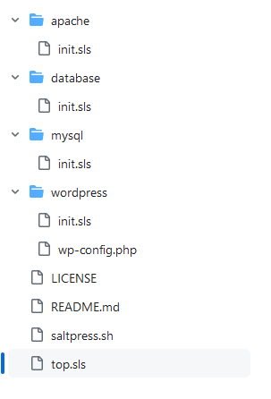

This seems to be the only part where something is downloaded from outside the package manager.

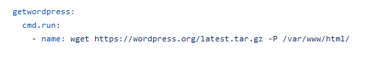

I googled a bit and checked WordPress URLs in VirusTotal. Seems like wordpress.org is a reputable site. Another one you may run into is wordpress.com. The difference is that wordpress.com is fully managed, while wordpress.org is self hosted, meaning that the software need to be downloaded from wordpress.org and managed by yourself.

I looked around wordpress.org to find something related to the tarball. It wasn't too straightforward to find this, but I found this guide that instructs on using the same command. With this in mind, I'd like to say that this is a reputable source.

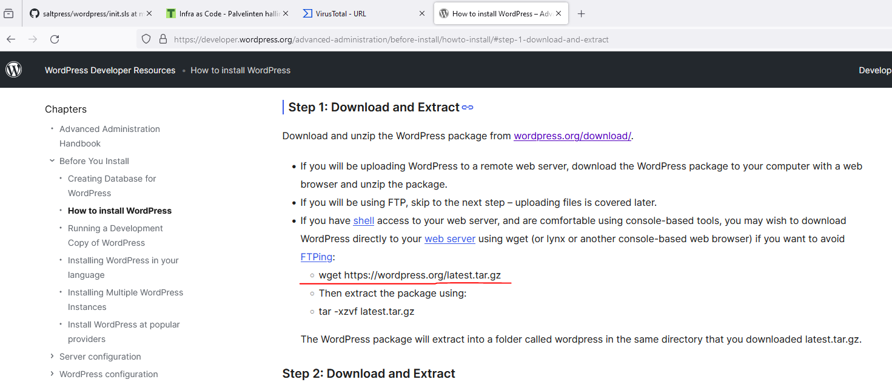

## Trying the module

I decided to configure a new VM and not use Vagrant for this. I didn't include the steps here since a report on it can be found in my Linux course's repository https://github.com/GitJuski/Linux-servers/blob/main/h1-GJ.md#installing-debian-on-virtualbox-report.

Here's the specs:

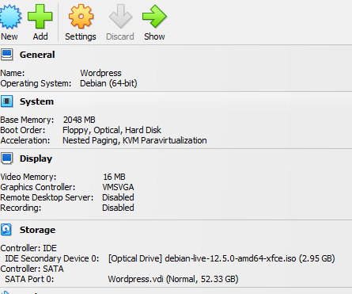

I started testing this module on May 5, 2024 at 12:05 PM. I used the same host machine as in the other task earlier on. I installed git and micro with `sudo apt install git micro`. Then I created a new directory and cloned the module there.

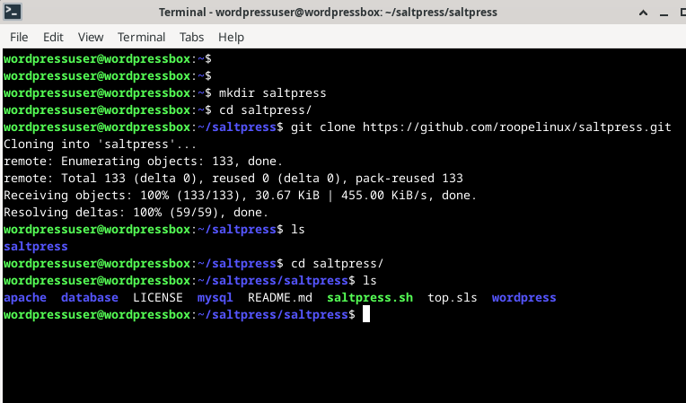

At this point I remembered that Debian 11 doesn't have MySQL in their repo. I didn't know about the situation in Debian 12, so I tested installing it.

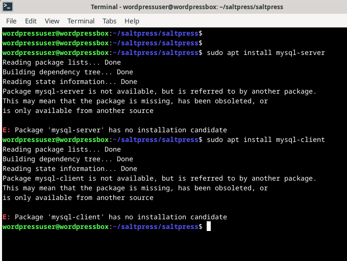

Then I downloaded a MySQL apt repo setup (Jetha, Boucheron & Ellingwood 2022). I replaced the package with the newest one and followed the guide to go proceed. The process was much simpler than I thought, and I've could have managed without the guide.

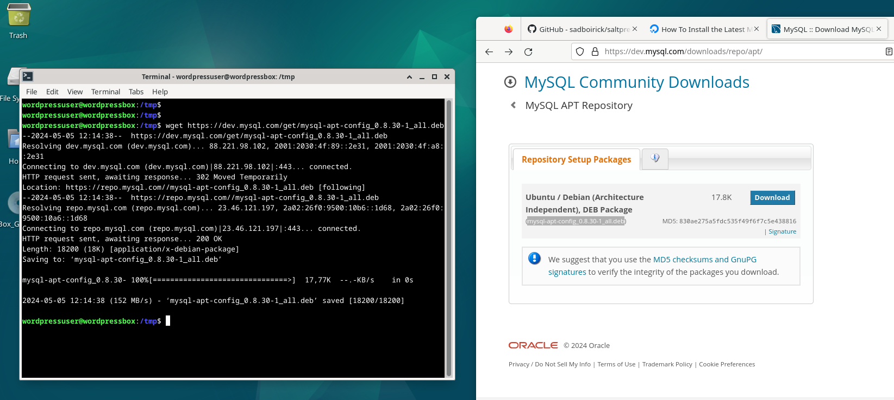

Here's the added repos.

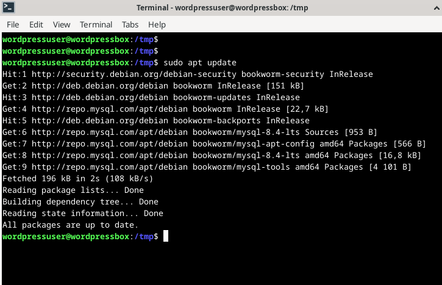

Then I tried to run the script but errors popped up. One of them was caused by salt. Of course Debian 12 didn't have the salt repo, and I didn't remember this since I've only recently used Debian 11. So, I added the repo (Saltproject s.a). Another error was caused by the fact that I didn't have /var/www/. I installed Apache manually `sudo apt install apache2` although the module should install it. 

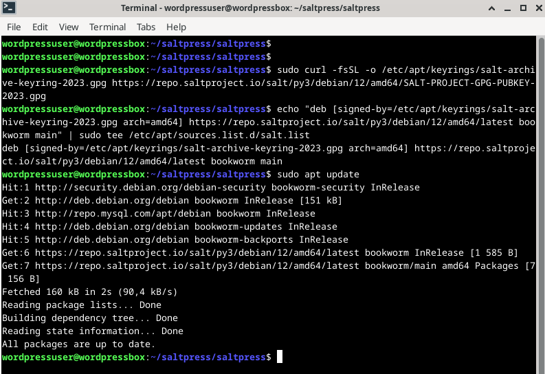

Then I tried it again `sudo ./saltpress.sh`. Everything else went okay except the mysql_query states.

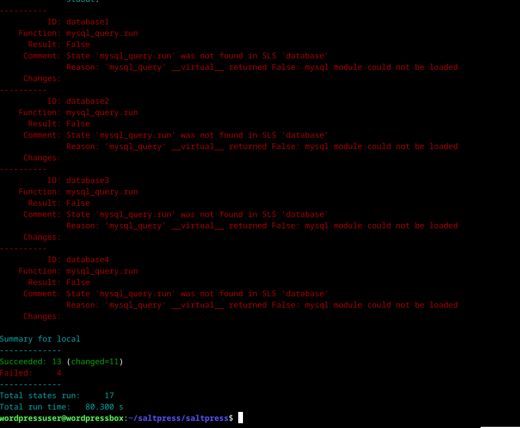

I checked localhost.

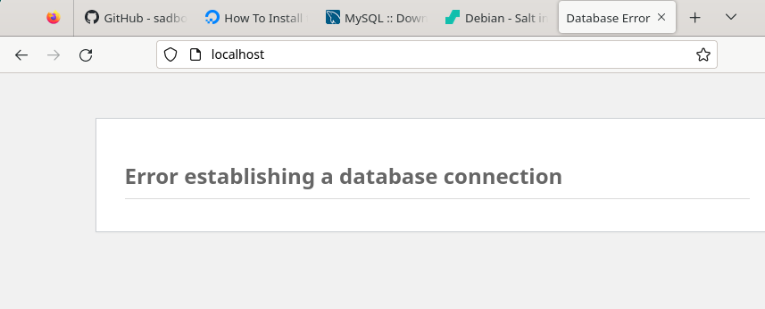

Then I tried to find a fix. I installed some parts and I googled a bit. I didn't have any motivation at that time so I dropped it. I just had a long fight with another database a few days ago, so I was done fixing anything related to databases at the time.

I was done at 12:40 PM.

I checked the Moduuli by Aatu Alanen next. I researched the source of the tarball the module downloads. Unfortunately, the site is no longer available. The Teamspeak server can be downloaded from teamspeak.com.

Then I decided to dig up my old laptop that had ubuntu as the host OS to test the Vagrantgoat by Aatu Horelli. After spending a long time updating, upgrading, attempting to get Virtualbox to work, trying to sign and enroll MOK, and encountering other inconveniences, I decided to abandon this task as well. At this point, this report has taken up far too much of my time.

Last try. I tested the LAMP module by Sari. First, I created a new vagrant machine (Debian 11). The module doesn't download anything outside the package manager.

### Testing

Fogot to check the starting time, but I was done at 2:57 PM. 

First things first.

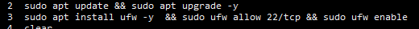

Then following Sari's directives.

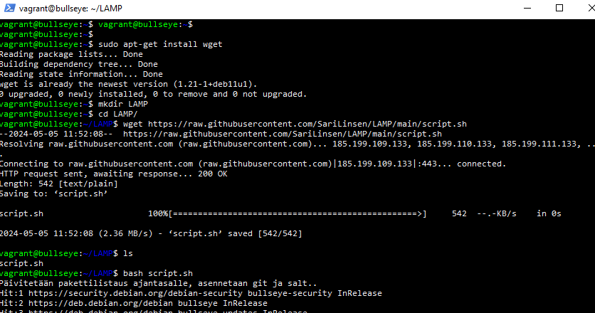

It worked!

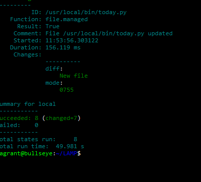

Localhost looks good.

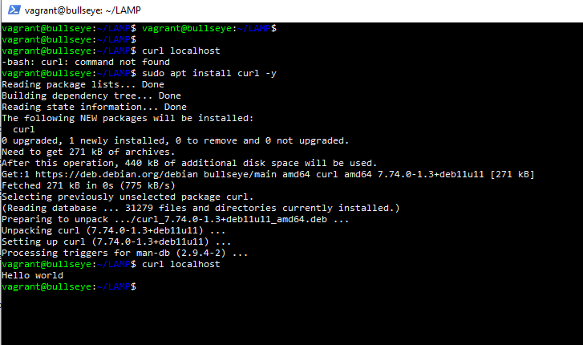

I checked out the python script.

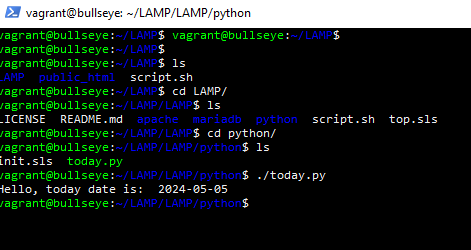

And of course at the time of writing this, I remembered that there was supposed to be a database installed as well. I had already destroyed the machine, so I did everything again to see the end results. It works!

# Task d. Five ideas.

Innovation isn't really one of my strong suits. Most projects I start are way out of my competence. I'm an ambitious person after all. So, I tried to come up with different ideas that were somewhere along the lines of manageable. The difficulty of these ideas varies, and simple projects can become complicated due to my tendency to dig deep into the rabbit hole.

1. I'm interested in setting up a three-tier architecture. Maybe a module that creates and configures three virtual machines with vagrant (web, app, db) and configures them to work together and within this three-tier architecture.

2. A module that configures an isolated space for security practice.

3. A module that configures a machine that has a website running with Apache & Django. This would be the easier version of the module number 1.

4. A module that configures multiple virtual machines as minions with different purposes. Web, Dev, Test, Docker etc.

5. Maybe a centralized log management solution.

# References

Alanen, A. 2020. Moduuli. Available at https://github.com/Suoladgl/Moduuli. Read on May 4, 2024.

Horelli, A. 2023. Vagrantgoat. Available at https://github.com/aatuhorelli/vagrantgoat/. Read on May 2, 2024.

Jetha, H., Boucheron, B. & Ellingwood, J. 2022. How To Install the Latest MySQL on Debian 10. Available at https://www.digitalocean.com/community/tutorials/how-to-install-the-latest-mysql-on-debian-10. Read on May 5, 2024.

Karvinen, T. 2024. Infra as Code - Palvelinten hallinta 2024. Available at https://terokarvinen.com/2024/configuration-management-2024-spring/.

Linsen, S. 2022. LAMP. Available at https://github.com/SariLinsen/LAMP/. Read on May 2, 2024.

Sailaranta, J. 2021. OfficeSetup. Available at https://github.com/jakesailaranta/OfficeSetup/. Read on May 2, 2024.

Saltproject. 2024. Windows Package Manager. Available at https://docs.saltproject.io/en/latest/topics/windows/windows-package-manager.html#usage. Read on May 2, 2024.

Saltproject. s.a. Install Salt on Debian 12 (Bookworm) amd64. Available at https://docs.saltproject.io/salt/install-guide/en/latest/topics/install-by-operating-system/debian.html#install-salt-on-debian-12-bookworm-amd64. Read on May 5, 2024.

Varttila, R. 2018. Saltpress. Available at https://github.com/sadboirick/saltpress. Read on May 4, 2024.

Wireshark. s.a. Installing Wireshark under Windows. Chapter 2. Building and Installing Wireshark. Available at https://www.wireshark.org/docs/wsug_html_chunked/ChBuildInstallWinInstall.html. Read on May 3, 2024.

Wireshark. 2020. WinPcap. Available at https://wiki.wireshark.org/WinPcap. Read on May 3, 2024.